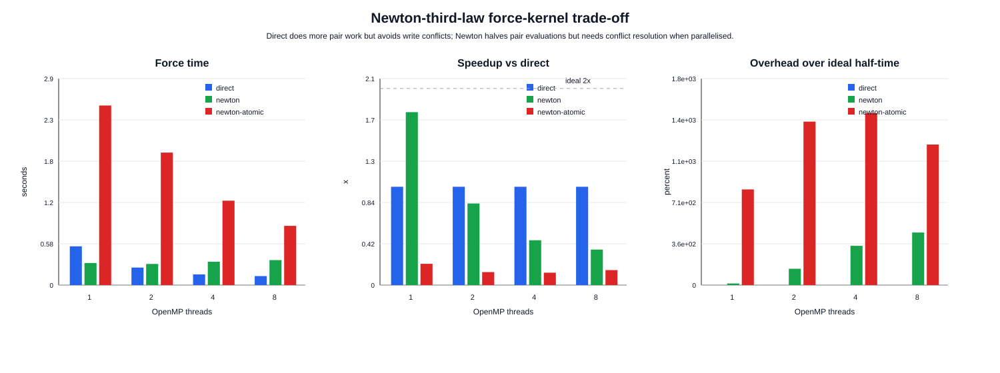
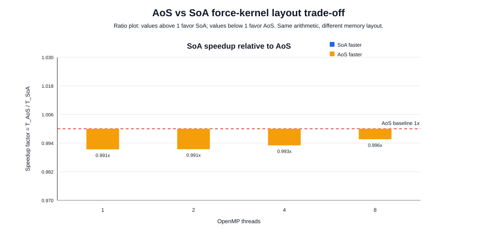
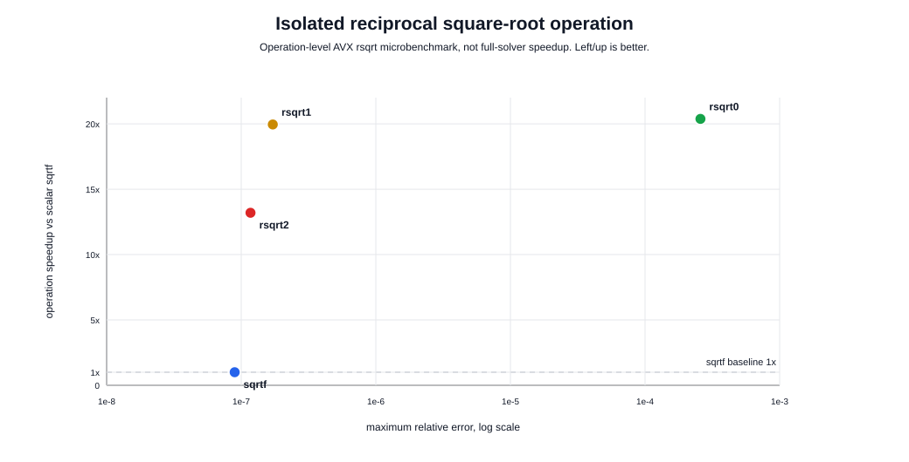
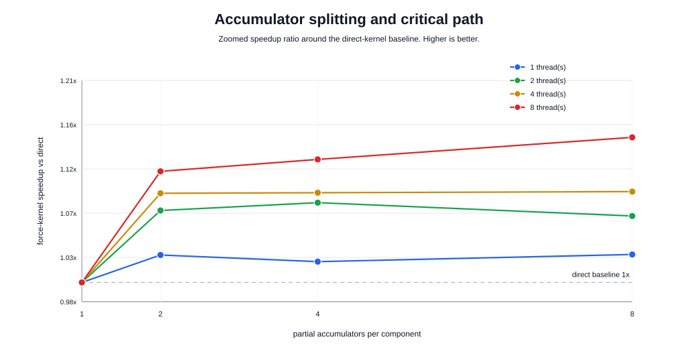
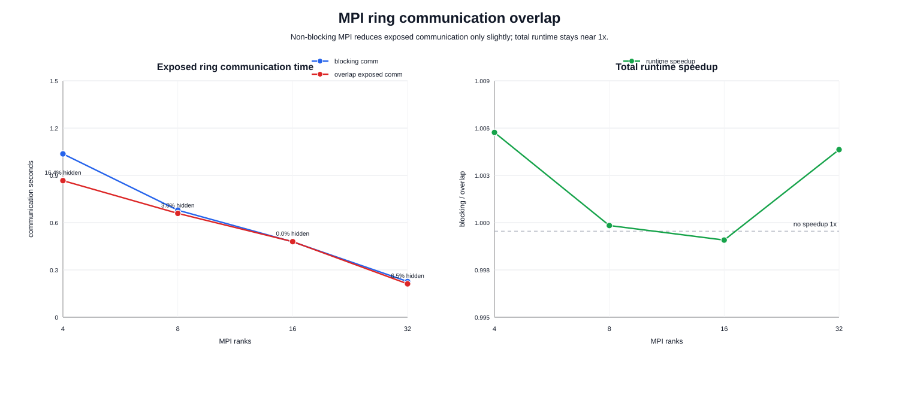
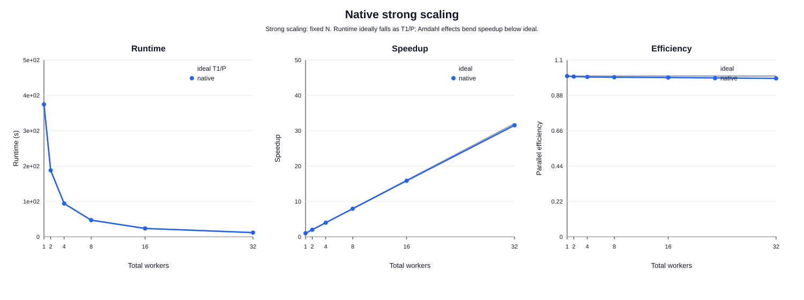
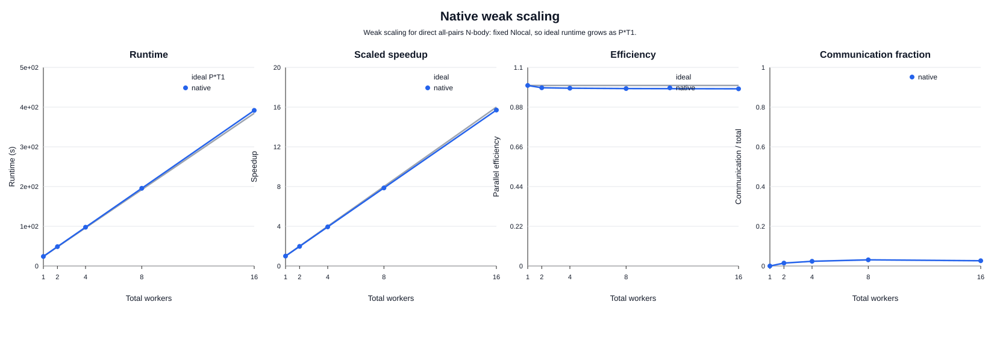
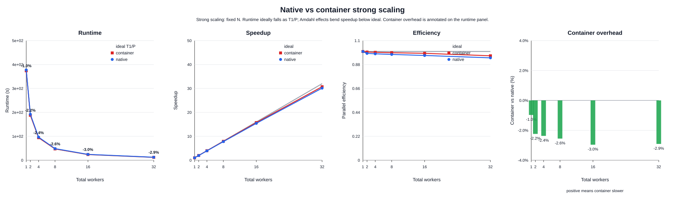
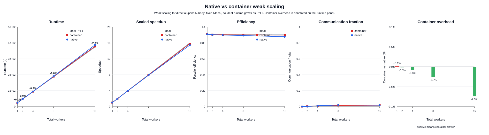
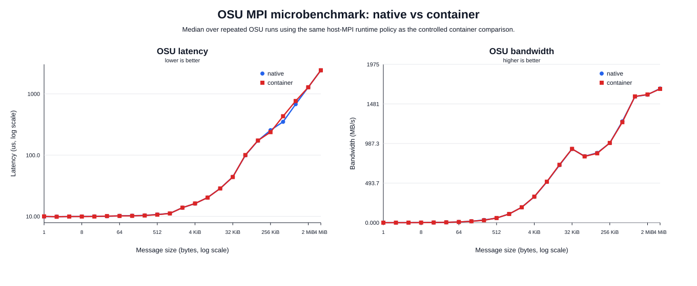

# HPC & Cloud Computing Report

## Exercise 1: Direct N-body Gravitational Simulation

Course: Data Science & AI    
Student: Elisabeth Imbalzano   
Student ID: SM3800119  
Exam session: 01/10/2026


## Abstract

This project investigates the implementation and performance optimization of a direct gravitational N-body simulation on a modern HPC system. The solver evaluates all pairwise gravitational interactions using a softened potential, resulting in an $O(N^2)$  computational kernel, and advances the system in time with a second-order Kick-Drift-Kick leapfrog integrator.

The implementation combines OpenMP shared-memory parallelism with an MPI ring-shift decomposition, allowing each process to retain ownership of its local particles while progressively exchanging source-particle blocks with the other ranks. Several kernel-level optimization strategies are evaluated, including Newton's third-law reuse, data-layout choices, reciprocal-square-root approximations, accumulator splitting, and communication-computation overlap.

Correctness is assessed independently of execution time through total-energy conservation, while performance is characterized through repeated measurements, strong and weak scaling, hybrid MPI/OpenMP mapping, and instrumented kernel timings. The final implementation is also evaluated inside a Singularity container to quantify launch, communication, and application-level overhead relative to native execution.

All final experiments were performed on the Orfeo HPC cluster using its AMD EPYC GENOA partition, since the originally targeted LEONARDO system was unavailable.


## 1. Introduction
Direct N-body simulation is a classical computational problem in which the motion of a system of particles is determined by their mutual interactions. In the gravitational case, every particle interacts with every other particle, making a straightforward implementation computationally expensive: evaluating the forces requires $O(N^2)$ pair interactions at every integration step.

Although more scalable algorithms such as Barnes-Hut trees or Fast Multipole Methods can reduce this asymptotic complexity, the objective of this project is deliberately different. The direct formulation provides a regular and arithmetic-intensive kernel in which the effects of parallel decomposition, vectorization, floating-point throughput, data layout, synchronization, and communication can be studied without being obscured by irregular hierarchical data structures.

The project therefore addresses three complementary aspects of high-performance computing. First, the numerical solver must preserve the physical behaviour of the simulated system, which is verified through total-energy conservation. Second, the computational kernel is optimized and parallelized using OpenMP and MPI, with particular attention to the trade-off between computation, synchronization, memory access, and communication. Finally, the native implementation is compared with a containerized execution environment to determine whether portability through Singularity introduces measurable performance overhead on an HPC system.

The resulting study is therefore not limited to obtaining the shortest execution time. Its main goal is to **measure and explain** how the different architectural and algorithmic choices affect correctness, single-node performance, parallel scalability, and portability.


## 2. Physical Model and Numerical Method

### 2.1 Gravitational N-body Model

The system consists of $N$ equal-mass particles evolving in three-dimensional space under their mutual gravitational attraction and open boundary conditions. Each particle $i$ is described by its *position* $\mathbf{x}_i$, *velocity* $\mathbf{v}_i$, and *mass* $m$.

The equations of motion are

$$
\frac{d\mathbf{x}_i}{dt} = \mathbf{v}_i,
\qquad
\frac{d\mathbf{v}_i}{dt} = \mathbf{a}_i ,
$$

where the acceleration is computed through direct summation over all the other particles:

$$
\mathbf{a}_i =
Gm
\sum_{j\neq i}
\frac{\mathbf{x}_j-\mathbf{x}_i}
{\left(
|\mathbf{x}_j-\mathbf{x}_i|^2+\epsilon^2
\right)^{3/2}} .
$$

The parameter $\epsilon$ is the *gravitational softening length*. It removes the singularity of the Newtonian force for very small particle separations and prevents close encounters from producing arbitrarily large accelerations. Importantly, softening is part of the physical model rather than a hidden numerical correction: changing $\epsilon$ modifies the short-range interaction between particles.

The same softened potential is used in the energy diagnostic,

$$
V =
-\sum_{i<j}
\frac{Gm^2}
{\sqrt{|\mathbf{x}_i-\mathbf{x}_j|^2+\epsilon^2}},
$$

ensuring consistency between the force evaluation and the physical quantity used for validation.

### 2.2 Initial Conditions and Softening

The main initial condition used in the experiments is a Plummer sphere, a spherically symmetric self-gravitating distribution commonly used as a controlled test case for gravitational dynamics. The repository also provides a uniform-ball generator with Maxwellian velocities, but the final validation and scalability experiments use Plummer initial conditions.

For the final experiments, the numerical parameters are

$$
\epsilon = 0.05,
\qquad
\Delta t = 10^{-4}.
$$

The choice of $\epsilon$ must balance physical fidelity and numerical stability. A useful order-of-magnitude reference is the characteristic mean interparticle spacing,

$$
\ell \sim \frac{R}{N^{1/3}},
$$

where $R$ is the characteristic size of the system.

For the validation problem with $N=10^4$ and a unit characteristic scale,

$$
\ell \sim 10^{-4/3} \approx 0.046,
$$

which is of the same order as the selected softening length $\epsilon=0.05$.

A substantially smaller softening would preserve stronger close encounters but would also require finer temporal resolution. Conversely, an excessively large $\epsilon$ would suppress small-scale gravitational structure. The selected value therefore provides a practical compromise for the benchmark configuration used in this work.

Changing $\epsilon$ therefore changes both the physical model and the practical cost of a simulation. For fixed $N$ and a fixed number of integration steps, the cost per force evaluation remains $O(N^2)$ because every particle pair is still visited. However, a smaller $\epsilon$ permits larger close-encounter accelerations and usually requires a smaller timestep, or more steps, to keep the energy drift below a fixed tolerance. A larger $\epsilon$ smooths those close encounters and can make the integration less stiff, but at the price of modifying the dynamics below scales comparable to $\epsilon$. This is why the relevant physical scale is the typical interparticle spacing $\ell$: choosing $\epsilon \ll \ell$ makes individual encounters dynamically important, while choosing $\epsilon \gg \ell$ over-smooths the system.


### 2.3 Kick-Drift-Kick Leapfrog Integration

The system is advanced in time using a second-order leapfrog integrator in Kick-Drift-Kick (KDK) form.

Given positions $\mathbf{x}(t)$, velocities $\mathbf{v}(t)$, and accelerations $\mathbf{a}(t)$, one integration step is

$$
\mathbf{v}\left(t+\frac{\Delta t}{2}\right)
=
\mathbf{v}(t)
+
\frac{\Delta t}{2}\mathbf{a}(t),
$$

$$
\mathbf{x}(t+\Delta t)
=
\mathbf{x}(t)
+
\Delta t\,
\mathbf{v}\left(t+\frac{\Delta t}{2}\right),
$$

followed by a new force evaluation at the updated positions,

$$
\mathbf{a}(t+\Delta t)
=
\mathbf{a}\!\left[\mathbf{x}(t+\Delta t)\right],
$$

and the second half kick,

$$
\mathbf{v}(t+\Delta t)
=
\mathbf{v}\left(t+\frac{\Delta t}{2}\right)
+
\frac{\Delta t}{2}\mathbf{a}(t+\Delta t).
$$

The KDK leapfrog scheme is second-order, symplectic, and time-reversible for this separable Hamiltonian system. These properties make it particularly suitable for gravitational simulations, where long-term conservation properties are more important than minimizing the local truncation error of a single step.

### 2.4 Energy Conservation as a Correctness Criterion

Correctness is evaluated independently of execution time through conservation of the total mechanical energy,

$$
E = T + V,
$$

with kinetic energy

$$
T = \frac{1}{2}
\sum_i m |\mathbf{v}_i|^2
$$

and the softened gravitational potential $V$ defined previously.

The solver monitors the relative energy drift,

$$
\delta_E(t)
=
\frac{|E(t)-E(0)|}
{\max(|E(0)|,\mathrm{tiny})},
$$

and records its maximum value over the simulated interval.

The final validation run uses a Plummer sphere with

- $N=10\,000$,
- $100$ KDK integration steps,
- $\Delta t = 10^{-4}$,
- $\epsilon = 0.05$,
- $8$ OpenMP threads,
- energy sampling every $10$ integration steps.

The measured maximum relative energy drift is

$$
\boxed{
\delta_E^{\max}
=
2.67\times10^{-7}
}
$$

which is well below the adopted validation threshold of $10^{-4}.$

This confirms that, for the benchmark configuration used throughout the project, the numerical integration preserves the total energy with a margin of more than two orders of magnitude relative to the acceptance criterion.


## 3. Parallel Implementation

The computational core of the solver is the direct evaluation of all pairwise
gravitational interactions. For each target particle $i$, the contribution of
every source particle $j \neq i$ is accumulated into its acceleration:

$$
\mathbf{a}_i =
Gm
\sum_{j\neq i}
\frac{\mathbf{x}_j-\mathbf{x}_i}
{\left(|\mathbf{x}_j-\mathbf{x}_i|^2+\epsilon^2\right)^{3/2}}.
$$

A direct evaluation therefore requires approximately $N(N-1)$ ordered
particle interactions per force evaluation, giving an asymptotic computational
cost of

$$
O(N^2).
$$

No tree-based, Fast Multipole, particle-mesh, or cutoff approximation is used.
The direct formulation is intentionally preserved because its regular
computational structure makes the effects of shared-memory parallelism,
distributed-memory communication, data layout, and low-level floating-point
optimizations directly measurable.


### 3.1 Data Layout

Particle data are stored using a Structure-of-Arrays (SoA) representation.
Instead of storing all properties of one particle contiguously in a single
structure, each physical quantity is stored in a separate array:

```text
x[0 ... N-1]
y[0 ... N-1]
z[0 ... N-1]

vx[0 ... N-1]
vy[0 ... N-1]
vz[0 ... N-1]

ax[0 ... N-1]
ay[0 ... N-1]
az[0 ... N-1]
```

This layout separates the data streams actually required by the force kernel.
For example, force evaluation primarily accesses the position arrays and writes
the acceleration arrays, without loading unrelated velocity components.

SoA also provides a convenient representation for MPI communication, since
particle coordinates can be transferred as contiguous arrays, and exposes a
data organization that is suitable for SIMD-oriented optimization.

The project also includes a controlled Array-of-Structures (AoS) versus SoA
benchmark. The corresponding performance results are discussed later in the
kernel-optimization section; the production implementation uses SoA
throughout.

### 3.2 OpenMP Parallelization

Within a shared-memory node, the force computation is parallelized with OpenMP
over the outer target-particle loop.

Conceptually, the computation is

```text
parallel for i = 0 ... N-1:
    ax_i = 0
    ay_i = 0
    az_i = 0

    for j = 0 ... N-1:
        if i != j:
            compute interaction(i, j)
            accumulate into ax_i, ay_i, az_i
```

Each OpenMP iteration is responsible for one target particle $i$. Therefore,
a thread updates only the acceleration associated with the target particles
assigned to it, while source-particle data are read-only.

This ownership pattern has two important advantages. First, iterations of the
outer loop are independent and can be distributed across threads with little
synchronization. Second, the inner force loop does not require atomic operations, since no two threads update the same target acceleration.

The production kernel deliberately evaluates both ordered interactions
$(i,j)$ and $(j,i)$ instead of exploiting Newton's third law. Although
Newton's third law can nearly halve the number of pair evaluations, a parallel
$i<j$ traversal requires updating the accelerations of both particles in each
pair, introducing shared writes and synchronization. This trade-off is studied
experimentally in Section 6.

The remaining drift and kick stages of the leapfrog integrator are only
$O(N)$ and can also be parallelized, but their computational cost is small
compared with the $O(N^2)$ force evaluation.

### 3.3 MPI Domain Decomposition

For distributed-memory execution, the global particle set is divided into equal contiguous blocks across $P$ MPI ranks.

Each rank permanently owns

$$ N_{\mathrm{local}} = \frac{N}{P} $$

target particles, referred to as its home block. Accelerations are computed
only for these local targets.

A rank cannot compute their complete acceleration using only its local
particles, because each target interacts with all $N$ particles in the
system. Instead of replicating the complete particle set on every process, the
implementation uses a **ring-shift** communication pattern.

Each MPI rank maintains:

- its permanent home block of target particles;
- a temporary source block used for force evaluation.

Initially, the source block contains the rank's own particles. After computing
the corresponding interactions, the source block is sent to the next rank in
the ring while a new block is received from the previous rank.

For $P$ ranks, the procedure is

```text
for ring phase = 0 ... P-1:

    compute interactions between
        local home targets
        and current source block

    rotate source block to next MPI rank
```

After $P$ phases, every rank has processed every source block and therefore
has accumulated the complete gravitational acceleration for all particles in
its home block.

For example, with four MPI ranks:

```text
phase 0:
    R0 <- block 0
    R1 <- block 1
    R2 <- block 2
    R3 <- block 3

phase 1:
    R0 <- block 3
    R1 <- block 0
    R2 <- block 1
    R3 <- block 2

phase 2:
    R0 <- block 2
    R1 <- block 3
    R2 <- block 0
    R3 <- block 1

phase 3:
    R0 <- block 1
    R1 <- block 2
    R2 <- block 3
    R3 <- block 0
```

The target particles never migrate: only the source blocks rotate. As a result,
each rank remains the unique owner of the accelerations of its local particles.

This ownership rule is particularly useful because *no distributed reduction* of
the force arrays is required after the ring traversal.

The current implementation assumes that $N$ is divisible by the number of MPI ranks. This restriction is sufficient for the benchmark configurations used in this work and avoids additional MPI_Scatterv/MPI_Gatherv bookkeeping.


### 3.4 Hybrid MPI + OpenMP Execution

The distributed ring decomposition is combined with OpenMP parallelism inside
each MPI rank.

For every ring phase, a rank evaluates

$$ N_{\mathrm{local}} \times N_{\mathrm{source}} $$

particle interactions. The outer loop over the local target particles is
parallelized among the OpenMP threads assigned to that rank.

The resulting hierarchy is therefore

```text
MPI
 └── distributes target-particle blocks across ranks
     └── ring-shifts source blocks between ranks
         └── OpenMP parallelizes the local target loop
             └── direct gravitational interaction kernel
```

This hybrid organization separates the two levels of parallelism:

- MPI handles particle distribution and communication across memory domains;
- OpenMP exploits the cores that share memory within each MPI rank.

The number of MPI ranks and OpenMP threads per rank is not fixed by the
algorithm. Different configurations change the balance between shared-memory
parallelism, MPI communication, and NUMA locality. This is particularly
important on the dual-socket GENOA node used for the experiments, which
contains multiple NUMA domains.

For this reason, the project explicitly compares different hybrid mappings,
including *one rank per socket, one rank per NUMA domain, and one rank per
physical core*. Their performance is analyzed later rather than assumed from
the hardware topology alone.


### 3.5 Blocking and Non-Blocking Ring Communication

The reference MPI implementation uses a blocking ring exchange based on
`MPI_Sendrecv`. A ring phase therefore consists conceptually of

```text
compute current block
        ↓
exchange source block
        ↓
compute next block
```

A second implementation uses *non-blocking communication*. The receive and send
for the next source block are posted before processing the current one:

```text
post MPI_Irecv / MPI_Isend
        ↓
compute current source block
        ↓
MPI_Waitall
        ↓
use received source block
```

The goal is to overlap communication with useful force computation.

However, non-blocking MPI calls do not imply that communication is completely
hidden. Effective overlap depends on MPI progress, message latency, resource
contention, workload balance, and the amount of computation available between
the non-blocking calls and the corresponding wait.

The blocking implementation is therefore used as the reference execution path,
while the non-blocking version is treated as a controlled optimization
experiment. The amount of communication actually hidden is measured in the
performance-analysis section.


## 4. Experimental Setup and Methodology

All final experiments were performed on the Orfeo HPC cluster, using the `GENOA` CPU partition. The original assignment targeted LEONARDO; however, LEONARDO was not available, so the benchmark campaign was moved to Orfeo while preserving the required experimental methodology.

System information was collected directly inside a SLURM allocation on a
GENOA compute node rather than on the login node. This is important because
processor topology, NUMA configuration, available memory, and software modules
may differ between login and compute nodes.

### 4.1 Hardware Platform

The GENOA node used for the experiments is based on two AMD EPYC 9374F processors.

| Component | Configuration |
|:---|:---|
| CPU | AMD EPYC 9374F 32-Core Processor |
| Sockets | 2 |
| Cores per socket | 32 |
| Hardware threads per core | 1 |
| Physical cores / visible CPUs | 64 |
| SMT | Disabled / not exposed |
| NUMA domains | 8 |
| Cores per NUMA domain | 8 |
| Main memory | 503 GiB |
| Swap | none |

The NUMA layout recorded from the allocated compute node is:

| NUMA node | Logical CPUs | Memory size |
|---:|:---|---:|
| 0 | 0-7 | 64053 MB |
| 1 | 8-15 | 64508 MB |
| 2 | 16-23 | 64508 MB |
| 3 | 24-31 | 64437 MB |
| 4 | 32-39 | 64508 MB |
| 5 | 40-47 | 64508 MB |
| 6 | 48-55 | 64508 MB |
| 7 | 56-63 | 64480 MB |

The `numactl -H` distance matrix has distance 10 within each NUMA node,
12 between NUMA domains on the same socket, and 32 between domains belonging
to different sockets. This is why the hybrid mapping study distinguishes
between one MPI rank per socket, one rank per NUMA domain, and one rank per
physical core.

The eight NUMA domains are particularly relevant for the hybrid MPI/OpenMP
experiments. Different rank/thread configurations can change both memory
locality and the number of MPI ring participants, so the optimal configuration
cannot be inferred from the total core count alone and must be measured
experimentally.


### 4.2 Software Environment

The final native runs used the following software environment:

| Component | Version |
|:---|:---|
| C compiler | GCC 14.3.1 |
| MPI implementation | Open MPI 4.1.6 |
| OpenMP runtime | GNU `libgomp` |
| Container runtime | SingularityCE 4.3.1 |
| Hardware-locality library | hwloc 2.12.0 |
| GNU C library | glibc 2.40 |
| External numerical libraries | none |

The MPI executable was built through the `mpicc` compiler wrapper provided by
the cluster OpenMPI module. No BLAS or external numerical library is used in
the force computation: the dominant kernel is implemented directly in C.

All numerical experiments reported in the final benchmark campaign use
double-precision arithmetic.

### 4.3 Compilation Configuration

Native performance binaries were compiled with

```text
-O3 -march=native -ffp-contract=fast -Wall -Wextra -Wpedantic
```

together with C11, double-precision selection, and OpenMP support where required.

The relevant options have the following roles:

- `-O3` enables aggressive compiler optimization;
- `-march=native` allows GCC to generate instructions specifically for the
allocated GENOA processor;
- `-ffp-contract=fast` allows floating-point contraction such as fused
  multiply-add operations where applicable;
- `-Wall -Wextra -Wpedantic` enable progressively stricter compiler warnings,
  including warnings beyond the default set and warnings required by strict ISO
  C conformance;
- `-std=c11` selects the C11 language standard;
- `-DNBODY_USE_DOUBLE` selects the double-precision scalar type used by the
  final numerical experiments;
- `-fopenmp` is enabled for the OpenMP and hybrid executables.

For the containerized benchmark, the application was instead compiled with

```text
-O3 -march=x86-64-v3 -ffp-contract=fast -Wall -Wextra -Wpedantic
```

The portable `x86-64-v3` target was chosen to avoid tying the container image to the exact CPU on which it was built. This improves portability but may prevent the compiler from exploiting all GENOA-specific instruction-set
features available to the native `-march=native` build.

On the measured GENOA nodes, the CPU supports AVX-512. A native build may therefore use wider vectors and more architecture-specific scheduling choices than an `x86-64-v3` build, whose portable baseline includes AVX2 but not AVX-512. In an ideal, fully vectorized double-precision kernel, moving from 256-bit AVX2 vectors to 512-bit AVX-512 vectors could in principle double the vector width. This is an upper bound rather than an expected application speedup: the current dominant force loop is not effectively vectorized, includes scalar inverse-square-root work, and is also affected by loop control, reductions, and MPI/runtime effects. The possible loss associated with the portable target is therefore discussed through this architectural bound, compiler vectorization diagnostics, and kernel microbenchmarks; the native-versus-container runs are interpreted separately as complete deployment comparisons rather than as an isolated measurement of the compilation target.

This difference is explicitly considered when interpreting the native versus
container measurements: the comparison includes not only the Singularity
runtime layer but also a deliberately more portable compilation target.


### 4.4 Parallel Execution Configuration

Parallel executions were launched through SLURM using `srun`. Each configuration is described by the number of MPI ranks $P$ and the number of OpenMP threads
per rank $T$, giving a total number of workers

$$
W = P \times T.
$$

The corresponding SLURM execution follows the form

```text
srun -n <ranks> -c <threads> ./nbody_mpi_omp [solver options]
```

where `-n` specifies the number of MPI processes and `-c` the number of CPU cores allocated to each process.

No additional explicit `mpirun --bind-to` option is used in the benchmark scripts. Process placement is delegated to the SLURM `srun` allocation, while thread placement is fixed through the OpenMP binding variables below. In the report this is the relevant `MPI_BIND`-equivalent run configuration: MPI ranks are created by `srun -n <ranks> -c <threads>`, and OpenMP threads are then bound within the cores assigned to each rank.

OpenMP execution is configured through
```text
OMP_NUM_THREADS = <threads>
OMP_PLACES      = cores
OMP_PROC_BIND   = close
```

so that OpenMP threads are placed on physical cores and kept close within the resources allocated to each MPI rank.

The rank binding used for the hybrid configurations was verified explicitly
with a dedicated SLURM check using `taskset -pc` inside each `srun` process.
The observed CPU affinities were:

| Configuration | Observed rank affinity | Interpretation |
|:---|:---|:---|
| $2\times32$ | rank 0: CPUs 0-31; rank 1: CPUs 32-63 | one rank per socket |
| $8\times8$ | each rank bound to one 8-core block: 0-7, 8-15, ..., 56-63 | one rank per NUMA domain |
| $64\times1$ | each rank bound to one distinct CPU | one rank per physical core |

The rank numbering is not necessarily monotonic with the NUMA-domain order,
especially in the $8\times8$ and $64\times1$ cases, but the affinity masks
confirm that the physical core allocation matches the intended mapping.

For the controlled native-versus-container scaling experiments, both backends
were executed with the same explicit OpenMPI runtime policy. The motivation and
exact environment variables are described in Section 8.1. The native-only
experiments do not use this restricted policy unless explicitly stated, because
they are intended to measure native performance on the host MPI stack.

The native-only hybrid mapping experiment was treated separately and used the host MPI default transport, since its objective was to characterize the best
native MPI/OpenMP mapping on the GENOA node rather than to isolate container overhead.

Each benchmark records the number of ranks, threads per rank, and total workers, so that the measured performance can be related directly to the selected parallel configuration.


### 4.5 Benchmark Configurations

The final benchmark campaign consists of several complementary experiments, each designed to isolate a different aspect of numerical correctness or parallel performance.

| Experiment | Problem size | Steps | Parallel configuration |
|:---|:---|---:|:---|
| Energy validation | $N=10\,000$ | 100 | 8 OpenMP threads |
| Complexity growth | $N=1\,000$ and $N=10\,000$ | 50 | 1 OpenMP thread |
| Hybrid mapping | $N=32\,768$ | 20 | $2\times32$, $8\times8$, $64\times1$ |
| MPI overlap | $N=32\,768$ | 20 | 4, 8, 16, 32 MPI ranks |
| Strong scaling | $N=32\,768$ | 100 | 1, 2, 4, 8, 16, 32 MPI ranks |
| Weak scaling | $N_{\mathrm{local}}=8192$ | 100 | 1, 2, 4, 8, 16 MPI ranks |

Here, a hybrid configuration $P\times T$ denotes $P$ MPI ranks and $T$
OpenMP threads per rank.

For *strong scaling*, the global particle count is kept fixed at

$$
N = 32768,
$$

while the number of MPI ranks is increased.

For *weak scaling*, the number of particles owned by each rank is kept fixed at

$$
N_{\mathrm{local}} = 8192,
$$

and the global problem size therefore grows according to

$$
N = P N_{\mathrm{local}}.
$$

The largest weak-scaling configuration consequently contains

$$
N = 16 \times 8192 = 131072
$$

particles.

The strong- and weak-scaling problem sizes are smaller than the values suggested in the original assignment. The reference configurations in the assignment use larger cases, such as $N=10^5$ for strong scaling and $N/P=10^4$ for weak scaling. These sizes were not practical under the Orfeo account limits available for this project: the GENOA association used for the final campaign imposed a two-hour maximum wall time per job. The experiment was therefore scaled down to $N=32768$ for strong scaling and $N_{\mathrm{local}}=8192$ for weak scaling.

The adaptation preserves the structure of the requested measurements: the
final scaling runs still use multiple process counts, 100 integration steps,
five repeated executions per configuration, median and sample standard
deviation reporting, and explicit strong/weak scaling analysis. The limitation
is that the measured saturation point may occur at a different process count
than it would for the larger assignment reference sizes.


### 4.6 Measurement and Statistical Methodology

Unless otherwise stated, each benchmark configuration is executed five times
under the same numerical and parallel configuration.

The *median* execution time is used as the representative performance value,
since it is less sensitive than the arithmetic mean to occasional system
noise. Run-to-run *variability* is reported through the sample standard
deviation.

No measured repetitions are removed as outliers from the final benchmark
sets, and no dedicated warm-up execution is discarded. Compilation and
initial-condition generation are performed before the repeated application
runs and are not included in the reported execution times.

The implementation contains explicit timing instrumentation for the main
execution phases, including total runtime, force evaluation, MPI
communication, integration operations, energy diagnostics, and initial force
evaluation. These measurements are used to distinguish computational cost
from communication and auxiliary work.

Performance measurements are always accompanied by an independent numerical
correctness check based on the maximum relative total-energy drift. Therefore,
an optimization is considered acceptable only if its performance improvement
does not compromise the numerical validation criterion.


### 4.7 Repository Map and Deliverable Traceability

The project repository is organized so that the numerical implementation,
benchmark execution, post-processing, container recipe, and report artifacts
remain separated. The main files used for the final results are:

```text
Nbody_serial/
├── nbody_common.h
│   └── shared particle type, precision type, math helpers, CLI utilities
│
├── nbody_core.h, nbody_core.c
│   └── force kernels, energy diagnostics, Leapfrog/KDK integration helpers
│
├── nbody_direct_serial.c
│   └── serial OpenMP-capable baseline for validation and kernel studies
│
├── nbody_mpi_omp.c
│   └── MPI + OpenMP production solver with ring-shift communication
│
├── generate_ic.c
│   └── Plummer initial-condition generator used by validation and benchmarks
│
├── benchmark_layout.c
├── benchmark_rsqrt_kernel.c
│   └── focused microbenchmarks for data layout and SIMD reciprocal square root
│
├── Makefile
│   └── native/MPI builds, precision selection, OpenMP flags
│
├── container/
│   ├── Dockerfile
│   │   └── Docker build environment required by the assignment
│   └── nbody.def
│       └── Singularity definition file for the Orfeo .sif image
│
├── scripts/
│   ├── benchmark/
│   │   └── benchmark drivers for validation, scaling, hybrid mapping,
│   │       and kernel trade-off experiments
│   ├── slurm/
│   │   └── SLURM entry points used on Orfeo
│   ├── analyze/
│   │   └── CSV summarization, table generation, and SVG plotting
│   ├── smoke/
│   │   └── native, MPI, and container smoke tests
│   └── utils/
│       └── system information, MPI binding checks, launch-overhead measurement
│
├── report/
│   ├── data/
│   │   └── hardware and software stack snapshot
│   ├── tables/
│   │   └── final CSV and Markdown tables used in the report
│   └── figures/
│       └── final SVG plots used in the report
│
└── REPORT.md
    └── final project report
```

This layout mirrors the experimental structure of the project: source files
implement the solver, `scripts/benchmark` and `scripts/slurm` produce the raw
measurements, `scripts/analyze` converts them into report-ready artifacts, and
`report/` stores only the final tables, figures, and setup information used in
the discussion.


## 5. Baseline Validation and Bottleneck Characterization

Before evaluating parallel scalability and kernel-level optimizations, the
baseline implementation was first checked for numerical correctness and for the
expected computational behaviour of the direct all-pairs algorithm.

The purpose of this section is therefore twofold: to verify that the solver
preserves the physical invariants with sufficient accuracy, and to identify
which part of the execution dominates the runtime before optimization.


### 5.1 Numerical Validation

The correctness criterion introduced in Section 2.4 was evaluated using a
Plummer sphere with

$$
N = 10\,000,
\qquad
\Delta t = 10^{-4},
\qquad
\epsilon = 0.05,
$$

integrated for 100 Kick-Drift-Kick steps using 8 OpenMP threads. Total energy
was evaluated every 10 integration steps.

The measured maximum relative energy drift was

$$
\delta_E^{\max} = 2.67 \times 10^{-7}.
$$

| $N$ | Steps | $\Delta t$ | $\epsilon$ | Threads | Max relative energy drift | Status |
|---:|---:|---:|---:|---:|---:|:---|
| $10\,000$ | $100$ | $10^{-4}$ | $0.05$ | 8 | $2.67\times10^{-7}$ | PASS |

This value is well below the adopted acceptance threshold of $10^{-4}$, 
showing that the selected combination of time step, gravitational softening,
and KDK integration provides stable numerical evolution for the reference
problem.

The energy result is used throughout the remaining experiments as an
independent correctness check. Performance improvements are therefore
considered valid only when the corresponding energy drift remains within the
same acceptance criterion.


### 5.2 Verification of $O(N^2)$ Computational Growth

The direct force kernel evaluates all ordered particle pairs except self-interactions. The number of pair evaluations is therefore

$$
N(N-1).
$$

Increasing the particle count from $N=1000$ to $N=10000$ gives the
theoretical interaction-count ratio

$$
\frac{10000(10000-1)}
     {1000(1000-1)}
=
100.090.
$$

To verify that the implementation follows this expected behaviour, the two problem sizes were executed using the same numerical parameters, 50 integration
steps, and a single OpenMP thread. A single thread was intentionally used to
avoid contaminating the comparison with OpenMP scheduling overhead for the
smaller problem.

The measured force timings are:

| $N$ | Steps | Force time (s) | Force time / step (s) |
|---:|---:|---:|---:|
| $1\,000$ | 50 | 0.180952 | 0.003619 |
| $10\,000$ | 50 | 18.124287 | 0.362486 |

The resulting measured ratio is

$$
\frac{0.362486}{0.003619}
\approx
100.161.
$$

Thus,

$$
\text{expected ratio}=100.090,
\qquad
\text{measured ratio}=100.161.
$$

The agreement is extremely close and provides direct experimental evidence
that the dominant force computation exhibits the expected quadratic growth
with $N$.


### 5.3 Runtime Breakdown and Bottleneck Identification

The baseline validation run was also used to decompose the execution time into
its main phases.

For the $N=10\,000$, $100$-step validation case, the measured timings were

| Component | Time (s) | Approx. fraction of total |
|:---|---:|---:|
| Force evaluation | $4.431348$ | $90.2\%$ |
| Energy diagnostics | $0.447601$ | $9.1\%$ |
| Other operations | $\approx 0.032$ | $<1\%$ |
| Total | $4.910674$ | $100\%$ |

Approximately $90\%$ of the measured runtime is therefore spent in the direct
force evaluation.

This dominance is consistent with the computational complexity of the solver.
Drift and kick updates operate once on each particle and are $O(N)$, whereas
the force evaluation performs $N(N-1)$ pair interactions and is $O(N^2)$.
The energy diagnostic is also based on pairwise interactions, but it is evaluated only periodically rather than at every force calculation.

The baseline application can therefore be characterized as being primarily
limited by the direct interaction kernel for the tested problem sizes.

On a single socket, the peak FLOP/s achievable by this kernel is determined by the number of active physical cores, the floating-point execution units available per core, the SIMD width actually reached by the compiled loop, and the ability of the instruction scheduler to keep independent multiply/add/FMA operations in flight. In this implementation the practical peak is lower than the architectural peak because the runtime-dominant interaction loop is scalar rather than fully vectorized, repeatedly evaluates an inverse distance, and carries reductions through the force accumulators. This is why the report uses measured Ginteraction/s as the main kernel-throughput indicator rather than claiming a hardware peak FLOP/s value.

To make the bottleneck claim quantitative, the performance analysis uses the
ordered particle-interaction throughput rather than raw GFLOP/s. This is a
cleaner metric for this code because the exact floating-point operation count
depends on how the square root, inverse distance, division, and fused
multiply-add instructions are counted. For the direct non-Newton formulation,
each force evaluation visits

$$
N(N-1)
$$

ordered source-target interactions. Since the KDK implementation computes the initial acceleration and then one new acceleration per integration step, the number of force evaluations is

$$
N_{\mathrm{force}} = N_{\mathrm{steps}} + 1.
$$

The reported interaction throughput is therefore

$$
R_{\mathrm{int}} =
\frac{N(N-1)N_{\mathrm{force}}}{t_{\mathrm{force}}}.
$$

For MPI runs, $t_{\mathrm{force}}$ is the maximum force time across ranks,
matching the timing reduction used by the solver. Ginteraction/s is the primary
kernel-throughput metric because it directly measures the rate at which the
algorithm processes its fundamental unit of work.

The detailed force-throughput table is presented after the native
strong-scaling results in Section 7.3, where the process counts and timing data
are introduced.

This observation determines the optimization strategy used in the following section. Rather than optimizing auxiliary $O(N)$ operations, the performance study focuses on the force kernel itself, investigating

- reduction of the number of pair evaluations through Newton's third law;
- data organization through AoS and SoA layouts;
- the cost of the inverse-square-root operation;
- floating-point dependency chains through multiple accumulators.

Communication-related optimizations are treated separately in the parallel performance section, where the importance of MPI communication can be evaluated as the number of processes increases.

## 6. Kernel-Level Optimization Study

After identifying the direct force evaluation as the dominant computational cost, several kernel-level optimizations were investigated. The goal was not only to reduce execution time, but also to understand which architectural effects limit the performance of the all-pairs interaction loop.

The experiments consider four complementary aspects of the force kernel: Newton's third-law reuse, particle data layout, reciprocal-square-root evaluation, and the dependency chain created by force accumulation.

Unless stated otherwise, optimization timings are reported as median $\pm$ sample standard deviation over five repetitions, and numerical correctness is checked through the same energy-drift criterion used for the baseline implementation.

### 6.1 Newton's Third Law

The baseline force kernel evaluates ordered particle pairs independently.
Therefore, both interactions $(i,j)$ and $(j,i)$ are computed.

Newton's third law makes it possible to evaluate only

$$
i < j
$$

and apply the equal and opposite contributions to both particles. In
principle, this reduces the number of pair evaluations by approximately a factor of two.

However, the optimization changes the parallel write pattern.

In the baseline direct kernel, a thread processing target particle $i$
updates only

$$
\mathbf{a}_i,
$$

so different OpenMP iterations are independent. In a Newton-reuse kernel, each
pair $(i,j)$ updates both

$$
\mathbf{a}_i
\qquad\text{and}\qquad
\mathbf{a}_j.
$$

Consequently, different threads may attempt to update the same acceleration array concurrently, introducing data races unless synchronization or privatization is used.

Three implementations were therefore compared. The `newton-atomic` variant is
included only as an additional diagnostic experiment: it is not intended as a
production optimization, but as a way to make the synchronization penalty of a
naive parallel Newton implementation explicit.

| Kernel | Pair traversal | Parallel update strategy |
|:---|:---|:---|
| `direct` | ordered pairs | OpenMP over independent target particles |
| `newton` | $i<j$ | serial, conflict-free reference |
| `newton-atomic` | $i<j$ | diagnostic OpenMP variant with atomic acceleration updates |

The measured force times are reported as median $\pm\sigma$ over five repetitions:

| Threads | `direct` (s) | `newton` (s) | `newton-atomic` (s) |
|---:|---:|---:|---:|
| 1 | $5.865157 \pm 0.008173$ | $3.510821 \pm 0.003258$ | $8.407843 \pm 0.011617$ |
| 2 | $3.119743 \pm 0.159910$ | $3.553018 \pm 0.022864$ | $8.587850 \pm 0.074676$ |
| 4 | $1.734899 \pm 0.036081$ | $3.510410 \pm 0.000948$ | $7.214137 \pm 0.037040$ |
| 8 | $0.893647 \pm 0.002144$ | $3.520837 \pm 0.025837$ | $6.265592 \pm 0.018730$ |

With one thread, Newton reuse reduces the force time from $5.87$ s to $3.51$ s, corresponding to a speedup of

$$
\frac{5.865157}{3.510821} \approx 1.67.
$$

The improvement is substantial, although smaller than the ideal factor of two, because halving the pair count does not eliminate loop overhead, memory accesses, or the remaining interaction arithmetic.

The plain `newton` implementation is intentionally serial. Its execution time therefore remains approximately constant as the requested OpenMP thread count increases. In contrast, the `direct` kernel scales efficiently because each thread owns its target-particle accumulators.

The `newton-atomic` implementation is therefore used as a negative control. It
demonstrates the cost of resolving the shared-write conflicts with fine-grained
synchronization. Although the number of evaluated pairs is reduced, multiple
atomic updates are required for each interaction. The resulting synchronization
and cache-coherence cost dominates the saved arithmetic.

For the production OpenMP/MPI implementation, the direct ownership model is therefore retained. Newton's third law is advantageous only when its arithmetic saving can be combined with a more efficient conflict-resolution strategy, such as privatized force buffers or block-wise reductions.




### 6.2 AoS versus SoA

Particle data organization can strongly affect memory access patterns and SIMD vectorization. Two layouts were therefore compared.

In an Array-of-Structures (AoS) representation, all fields associated with a particle are stored together:

```text
particle[i] = {x, y, z, vx, vy, vz, ax, ay, az}
```

In a Structure-of-Arrays (SoA) representation, each quantity is stored in an independent contiguous array:

x[], y[], z[], vx[], vy[], vz[], ax[], ay[], az[]

SoA is generally attractive for numerical kernels because consecutive SIMD lanes can load the same physical quantity from consecutive memory locations.
The production solver therefore uses SoA.

However, the layout benchmark shows that SoA alone does not improve the performance of the current force kernel:

| Threads | AoS force time (s) | SoA force time (s) | SoA speedup |
| ------: | -----------------: | -----------------: | ----------: |
|       1 | $0.903034 \pm 0.000151$ | $0.910895 \pm 0.000439$ |       0.991 |
|       2 | $0.451970 \pm 0.000151$ | $0.455871 \pm 0.001764$ |       0.991 |
|       4 | $0.226311 \pm 0.000205$ | $0.227897 \pm 0.001877$ |       0.993 |
|       8 | $0.115289 \pm 0.001032$ | $0.115800 \pm 0.025404$ |       0.996 |

The two layouts are effectively equivalent in median execution time, with
differences below approximately one percent. The eight-thread SoA measurement
shows higher run-to-run variability than the corresponding AoS case, but its
median remains within one percent of the AoS median. The computed
accelerations also agree within the reported numerical tolerance.

To check whether the layout change actually enabled SIMD execution of the
dominant loop, the benchmark was recompiled with GCC vectorization reporting
enabled:

```text
-fopt-info-vec-all=<vectorization-report>
```

The relevant loops are the inner all-pairs loops of the SoA and AoS force
kernels:

```text
benchmark_layout.c:116  inner j-loop of compute_accelerations_soa
benchmark_layout.c:159  inner j-loop of compute_accelerations_aos
```

For both loops, GCC reports missed vectorization:

```text
benchmark_layout.c:116:29: missed: couldn't vectorize loop
benchmark_layout.c:116:29: missed: not vectorized: unsupported control flow in loop.
nbody_common.h:81:10: missed: statement clobbers memory: _86 = sqrt (r2_66);

benchmark_layout.c:159:29: missed: couldn't vectorize loop
benchmark_layout.c:159:29: missed: not vectorized: unsupported control flow in loop.
nbody_common.h:81:10: missed: statement clobbers memory: _74 = sqrt (r2_54);
```

The significant point is therefore not whether GCC can vectorize some minor
auxiliary code, but that the runtime-dominant all-pairs force loop is not
effectively vectorized. The relevant obstacles are the conditional
self-interaction check `if (j != i)`, the scalar inverse-distance calculation
through `dtype_sqrt`, and the scalar accumulation into the three force
components.

Therefore, this experiment should not be interpreted as evidence that AoS and SoA are generally equivalent. Rather, it shows that improving the memory layout alone is insufficient when the dominant interaction loop remains scalar.

SoA is nevertheless retained in the production code because it provides a cleaner representation for MPI block transfers and exposes the data streams required by future SIMD-oriented implementations.



Hardware-counter tools such as `perf`, `PAPI`, and `LIKWID` were not available in the Orfeo environment used for the measurements. The layout analysis therefore follows the optional compiler-report part of the vectorization study, but cannot confirm the result with counters such as packed floating-point instruction events. The evidence used here is consequently the combination of instrumented timings, numerical agreement, derived throughput, and GCC vectorization diagnostics rather than hardware performance counters.


### 6.3 Reciprocal Square Root

The gravitational interaction repeatedly evaluates

$$
\frac{1}{\sqrt{r^2+\epsilon^2}},
$$

making the inverse-square-root operation a natural optimization target.

The reference implementation uses the standard library square-root path.
Approximate reciprocal-square-root instructions provide a faster initial estimate, which can be improved through Newton-Raphson refinement.

The optimization was evaluated at two different levels: an isolated SIMD microbenchmark and the complete force solver.

#### Isolated reciprocal-square-root kernel

The SIMD microbenchmark compares a scalar `sqrtf` reference with an AVX reciprocal-square-root estimate and zero, one, or two Newton refinements.

| Method | Time (s) | Gvalues/s | Speedup | Max relative error |
|:---|---:|---:|---:|---:|
| `sqrtf` | $0.032575 \pm 0.000021$ | 0.515 | 1.000 | $8.94\times10^{-8}$ |
| `rsqrt0` | $0.001599 \pm 0.000011$ | 10.494 | 20.376 | $2.58\times10^{-4}$ |
| `rsqrt1` | $0.001633 \pm 0.000006$ | 10.277 | 19.953 | $1.72\times10^{-7}$ |
| `rsqrt2` | $0.002469 \pm 0.000004$ | 6.796 | 13.195 | $1.17\times10^{-7}$ |



The raw hardware estimate is extremely fast but introduces a relative error of approximately $2.6\times10^{-4}$. A single Newton refinement reduces this error by roughly three orders of magnitude while retaining most of the operation-level throughput.

This demonstrates the potential benefit of reciprocal-square-root
approximations when the operation can be evaluated efficiently using SIMD.

The complete solver shows a different result.

At eight OpenMP threads:

| Method | Force time (s) | Speedup vs `libm` | Max energy drift |
|:---|---:|---:|---:|
| `libm` | $0.894669 \pm 0.055731$ | 1.000 | $4.083561\times10^{-8}$ |
| `rsqrt1` | $1.028367 \pm 0.045048$ | 0.870 | $4.085352\times10^{-8}$ |
| `rsqrt2` | $1.290443 \pm 0.104594$ | 0.693 | $4.083561\times10^{-8}$ |
| `rsqrt3` | $1.476621 \pm 0.010179$ | 0.606 | $4.083561\times10^{-8}$ |

In the current full solver, the median runtime of all reciprocal-square-root
variants is higher than the `libm` baseline, with the degradation becoming
particularly clear as additional refinement steps are introduced.

The reason is that the two experiments expose different levels of the implementation. The isolated benchmark directly exploits SIMD reciprocal square root instructions. The complete force loop, however, is not vectorized, and its scalar approximation path includes conversion through a single-precision estimate followed by Newton refinement in double precision.
The operation-level SIMD advantage therefore does not translate directly into a solver-level speedup.

The full-solver experiment is nevertheless important from the numerical point of view. After sufficient Newton refinement, the measured energy drift converges to the `libm` reference value. In particular, `rsqrt2` already reproduces the baseline drift within the resolution of this experiment. This is the check that the energy-conservation diagnostic is still testing the time integrator rather than being dominated by reciprocal-square-root approximation error: if the approximation error were saturating the diagnostic, the refined `rsqrt` variants would show a persistent drift offset relative to the `libm` baseline. Instead, the refined variants converge back to the same measured drift level.

The production solver therefore retains the conservative `libm` path, while the reciprocal-square-root experiments demonstrate both the potential SIMD performance advantage and the accuracy requirements that would need to be satisfied by a future vectorized implementation.


### 6.4 Accumulator Splitting and Critical Path

The direct force loop repeatedly accumulates contributions into the same three acceleration components:

$$
a_x \mathrel{+}= \Delta x\,s,
\qquad
a_y \mathrel{+}= \Delta y\,s,
\qquad
a_z \mathrel{+}= \Delta z\,s.
$$

For a fixed target particle, every iteration of the inner loop depends on the result produced by the previous iteration. This creates a loop-carried dependency chain through the force accumulators and can limit instruction-level parallelism even when several floating-point execution units are available.

To reduce this dependency, the force kernel was implemented with multiple independent partial accumulators. Instead of updating a single $(a_x,a_y,a_z)$ triple, successive interactions are distributed over 2, 4, or 8 independent accumulator sets and combined only after the inner loop:

```text
ax0 += contribution_j
ax1 += contribution_j+1
...
ax = ax0 + ax1 + ...
```

The optimization does not change the number of particle interactions or the physical model. It only increases the amount of independent arithmetic available to the processor.

The full benchmark tested 1, 2, 4, and 8 partial accumulators for each OpenMP thread count. The table below reports the best variant at each thread count, while the plot shows the full saturation trend.

| Threads | Best variant | Best force time (s) | Best speedup |
|---:|:---|---:|---:|
| 1 | `direct-split8` | $5.656612 \pm 0.008691$ | 1.029 |
| 2 | `direct-split4` | $2.857590 \pm 0.001465$ | 1.083 |
| 4 | `direct-split8` | $1.592580 \pm 0.002604$ | 1.094 |
| 8 | `direct-split8` | $0.780765 \pm 0.022961$ | 1.151 |

The largest improvement is observed with eight OpenMP threads, where
`direct-split8` reduces the force time from

$$
0.898525\ \mathrm{s}
$$

to

$$
0.780765\ \mathrm{s},
$$

corresponding to a speedup of approximately

$$
1.15\times.
$$



The results also show that the benefit saturates. Moving from one accumulator to a small number of independent partial sums removes much of the original dependency bottleneck, while further increasing the number of accumulators provides only modest additional improvement.

This behaviour is expected because accumulator splitting introduces its own costs: additional live registers, a final reduction of the partial sums, and greater register pressure. Once enough independent arithmetic streams are available, other components of the force kernel become limiting, including the inverse-distance calculation, loop control, memory accesses, and OpenMP overhead.

All accumulator variants reproduce the same energy drift as the reference kernel in the corresponding benchmark. Accumulator splitting therefore provides a moderate performance improvement without changing the numerical result.

---

Overall, the optimization study shows that reducing arithmetic work does not
automatically produce the best parallel implementation. Newton's third law reduces the pair count but complicates force ownership; SoA provides a SIMD-friendly representation but gives little benefit while the force loop remains scalar; reciprocal square root is extremely effective in isolation but
does not accelerate the current non-vectorized solver; and accumulator
splitting provides the most direct improvement to the existing production
kernel by reducing its dependency chain.

These results motivate the next level of analysis: determining how the
optimized computational kernel interacts with MPI communication and how the application scales as additional processes are introduced.


## 7. Parallel Performance Analysis

After characterizing the computational kernel, the analysis is extended to the parallel behaviour of the complete application. The experiments investigate three complementary aspects: the balance between MPI ranks and OpenMP threads,
the possibility of overlapping ring communication with computation, and the strong- and weak-scaling behaviour of the distributed solver.

The objective is not only to measure speedup, but also to determine whether the dominant bottleneck identified in Section 5 remains computational as the number
of processes increases, or whether communication and synchronization begin to limit scalability.


### 7.1 Hybrid MPI/OpenMP Mapping

The GENOA node provides 64 physical cores distributed across two sockets and eight NUMA domains. This allows several MPI/OpenMP decompositions to use the same total amount of computational resources.

Three representative configurations were compared:

$$
2\times32,\qquad
8\times8,\qquad
64\times1,
$$

where $P\times T$ denotes $P$ MPI ranks and $T$ OpenMP threads per rank.
All three configurations therefore use 64 workers in total.

The verified affinity masks correspond to the following decomposition
strategies:

| Configuration | Interpretation |
|:---|:---|
| $2\times32$ | one MPI rank per socket |
| $8\times8$ | one MPI rank per NUMA domain |
| $64\times1$ | one MPI rank per physical core |

The experiment uses $N=32768$, 20 integration steps, and five repetitions per configuration.

Total times are reported as median $\pm$ sample standard deviation over five
repetitions; force and communication columns report the corresponding median
values. Since all configurations use the same global problem size and the same
number of force evaluations, the force-kernel interaction throughput can also
be compared directly:

| Ranks | Threads | Total time (s) | Force time (s) | Force / total | Ginteraction/s | Communication time (s) |
|---:|---:|---:|---:|---:|---:|---:|
| 2 | 32 | $1.357946 \pm 0.002116$ | 1.208748 | 89.01% | 18.654 | 0.015178 |
| 8 | 8 | $1.356582 \pm 0.009521$ | 1.205893 | 88.89% | 18.698 | 0.094987 |
| 64 | 1 | $1.362196 \pm 0.006402$ | 1.215686 | 89.24% | 18.547 | 0.143501 |

The three mappings are essentially equivalent in total runtime. The lowest
median is obtained by the $8\times8$ configuration, but the full spread between
the fastest and slowest median runtimes is only about $0.4\%$, which is smaller
than the run-to-run variability of the $8\times8$ case. Therefore, this result
should not be interpreted as a decisive win for any single mapping.

The force-kernel throughput confirms the same conclusion. All configurations
sustain approximately $18.5$--$18.7$ Ginteraction/s, and the force kernel
accounts for about $89\%$ of the total runtime in every case. Thus, changing
the MPI/OpenMP decomposition affects the communication pattern more strongly
than it affects the dominant arithmetic kernel.

The result illustrates the trade-off inherent in hybrid programming. Using
fewer MPI ranks reduces the number of participants in the ring communication
and leaves more parallel work to OpenMP. Using one rank per core eliminates OpenMP scheduling within each rank but introduces many more MPI ring phases.
This trend is visible in the communication timer: the median communication time
increases from $0.015$ s for $2\times32$ to $0.095$ s for $8\times8$ and
$0.144$ s for $64\times1$.

For this problem size on a single GENOA node, however, this increase in MPI
communication is too small to change the total runtime substantially, because
the direct force calculation still dominates. The main conclusion is therefore
that topology suggests useful candidate mappings, but the optimal mapping
cannot be inferred from topology alone; it must be measured for the actual
kernel and problem size.


### 7.2 Communication-Computation Overlap

The ring decomposition exposes a natural opportunity for
communication-computation overlap. In the blocking implementation, each rank
first evaluates the current source block and then exchanges it with the
neighbouring ranks.

The non-blocking implementation instead posts the communication for the next
ring phase before computing the current block:

```text
MPI_Irecv / MPI_Isend
        ↓
force computation
        ↓
MPI_Waitall
```

If communication progressed completely in the background, most or all of the ring-exchange time could theoretically be hidden by the much larger force calculation.

To quantify the actual effect, the hidden communication time is defined as

$$
T_{\mathrm{hidden}} = T_{\mathrm{comm,blocking}} - T_{\mathrm{comm,overlap}},
$$

and the achieved overlap fraction as

$$
f_{\mathrm{overlap}} = \frac{T_{\mathrm{hidden}}} {T_{\mathrm{comm,blocking}}}.
$$

The experiment uses $N=32768$, 20 integration steps, one thread per MPI
rank, and five repetitions. Total times are reported as median $\pm\sigma$;
communication columns report the corresponding median exposed communication
times used to compute the overlap fraction.

| Ranks | Blocking total (s) | Overlap total (s) | Blocking comm. (s) | Hidden comm. (s) | Achieved overlap |
| ----: | -----------------: | ----------------: | -----------------: | ---------------: | ---------------: |
|     4 | $20.987808 \pm 0.078594$ | $20.868140 \pm 0.007770$ |           1.036399 |         0.169679 |            16.4% |
|     8 | $10.513724 \pm 0.083738$ | $10.510297 \pm 0.007663$ |           0.678918 |         0.020134 |             3.0% |
|    16 | $5.358677 \pm 0.006079$ | $5.361461 \pm 0.001656$ |           0.478483 |         0.000000 |             0.0% |
|    32 | $2.729329 \pm 0.083506$ | $2.716461 \pm 0.002813$ |           0.226680 |         0.014705 |             6.5% |



Despite the large amount of computation available between the non-blocking MPI
calls, the measured overlap ranges only from $0\%$ to $16.4\%$.

More importantly, the effect on total runtime is very small. The corresponding runtime ratios remain approximately between

$$ 
0.999\times 
\quad
\text{and}\quad 1.006\times. 
$$

Thus, replacing blocking communication with `MPI_Isend` and `MPI_Irecv` does not produce a significant application-level speedup for this experiment.

The result shows that non-blocking MPI calls alone do not guarantee effective asynchronous progress. Communication may still require execution inside the MPI library, while message startup, synchronization at the end of each phase, rank imbalance, and the overhead of managing the non-blocking operations can remain exposed.

For the tested one-node configuration, communication is already small compared with the direct force calculation. Consequently, even perfect overlap would have only a limited effect on total execution time.


### 7.3 Strong Scaling

Strong scaling measures how execution time decreases when additional parallel resources are applied to a fixed global problem.

For the strong-scaling experiment, the particle count is fixed at

$$
N=32768,
$$

and the number of MPI ranks is varied over

$$
P\in\{1,2,4,8,16,32\}.
$$

Each rank uses one OpenMP thread and every configuration performs 100
integration steps.

Speedup is defined relative to the one-rank execution:

$$
S(P)=\frac{T(1)}{T(P)},
$$

while parallel efficiency is

$$
E(P)=\frac{S(P)}{P}.
$$

Ideal strong scaling therefore corresponds to

$$
S(P)=P,
\qquad
E(P)=1.
$$



The measured native results are reported as median $\pm$ sample standard deviation over five repetitions:

| MPI ranks | Total time (s) | Speedup | Efficiency |
|---:|---:|---:|---:|
| 1 | $374.387700 \pm 0.490059$ | 1.000 | 1.000 |
| 2 | $187.821448 \pm 0.065840$ | 1.993 | 0.997 |
| 4 | $94.101276 \pm 0.017829$ | 3.979 | 0.995 |
| 8 | $47.148061 \pm 0.005166$ | 7.941 | 0.993 |
| 16 | $23.620087 \pm 0.005129$ | 15.850 | 0.991 |
| 32 | $11.870895 \pm 0.015770$ | 31.538 | 0.986 |

At 32 MPI ranks, the native execution achieves

$$
S(32)=31.54
$$

and

$$
E(32)=0.986.
$$

The scaling is therefore very close to ideal throughout the measured range. The reported standard deviations are small compared with the median runtimes, so the trend is stable across the five repetitions.

At larger process counts the efficiency decreases only mildly, remaining
$98.6\%$ at 32 ranks. The measured communication contribution grows with the
number of MPI ranks, but remains small: the communication fraction increases
from zero at one rank to only about $2.5\%$ at 32 ranks.

Therefore, no strong communication or serial bottleneck is reached within the tested process range. The $O(N^2)$ force kernel remains sufficiently
expensive to amortize ring communication and other fixed parallel overheads.
At the largest measured configuration, each rank still owns
$N_{\mathrm{local}}=1024$ particles, which is enough work per rank for the
direct all-pairs kernel to dominate the runtime. The expected Amdahl floor is
therefore not yet visible in this dataset. Reaching it would require either
increasing the process count further at fixed $N$ or decreasing $N$ until the
local force work becomes too small to hide communication startup, diagnostics,
and synchronization.

#### Force-kernel interaction throughput

The strong-scaling timings can also be read as a throughput measurement of the
dominant force kernel. For this experiment, $N=32768$ and the KDK integrator
performs 101 force evaluations: one initial acceleration evaluation and one new
force evaluation after each drift step. The measured throughput is therefore

$$
R_{\mathrm{int}} =
\frac{32768\cdot32767\cdot101}{t_{\mathrm{force}}}.
$$

The throughput efficiency is defined as

$$
E_{\mathrm{throughput}}(P)
=
\frac{R_{\mathrm{int}}(P)}
{P\,R_{\mathrm{int}}(1)}.
$$

A value close to one indicates that the interaction throughput grows
proportionally to the number of MPI ranks. Values slightly above unity are
within measurement variability and should not be interpreted as super-linear
algorithmic scaling.

| MPI ranks | Force time (s) | Force / total | Ginteraction/s | Ideal Ginteraction/s | Throughput efficiency |
|---:|---:|---:|---:|---:|---:|
| 1 | $370.531173 \pm 0.489564$ | 98.97% | 0.293 | 0.293 | 1.000 |
| 2 | $185.020960 \pm 0.084704$ | 98.51% | 0.586 | 0.585 | 1.001 |
| 4 | $92.475055 \pm 0.019084$ | 98.27% | 1.173 | 1.171 | 1.002 |
| 8 | $46.242101 \pm 0.003023$ | 98.08% | 2.345 | 2.341 | 1.002 |
| 16 | $23.142003 \pm 0.001770$ | 97.98% | 4.686 | 4.683 | 1.001 |
| 32 | $11.584479 \pm 0.006580$ | 97.59% | 9.361 | 9.366 | 1.000 |

The interaction rate increases from approximately $0.293$ Ginteraction/s on
one MPI rank to $9.361$ Ginteraction/s on 32 MPI ranks. This is almost exactly
a $32\times$ increase, matching the strong-scaling result from the wall-clock
timings. At the same time, the force kernel accounts for $97.6$--$99.0\%$ of
the total runtime, confirming that the measured speedup is driven primarily by
parallelizing the direct all-pairs computation rather than by changes in the
auxiliary integration or diagnostic phases.

### 7.4 Weak Scaling

In the weak-scaling experiment, the number of target particles owned by each MPI rank is kept fixed at

$$
N_{\mathrm{local}}=8192,
$$

while the global particle count grows as

$$
N=P\,N_{\mathrm{local}}.
$$

For many local-domain algorithms, ideal weak scaling would imply a constant runtime because each process performs a constant amount of work. A direct all-pairs N-body algorithm behaves differently.

Each rank owns $N_{\mathrm{local}}$ target particles, but every target must interact with all

$$
N=P\,N_{\mathrm{local}}
$$

source particles. The work per rank is therefore

$$
W_{\mathrm{rank}}
\propto
N_{\mathrm{local}}N
=
P\,N_{\mathrm{local}}^2.
$$

Thus, even under ideal parallel scaling, runtime is expected to grow linearly with the number of ranks:

$$
T_{\mathrm{ideal}}(P)=P\,T(1).
$$

For this reason, weak-scaling efficiency is defined relative to this
algorithm-aware ideal:

$$
E_{\mathrm{weak}}(P)
=
\frac{P\,T(1)}{T(P)}.
$$

A value close to one indicates that the measured runtime follows the expected growth of the direct all-pairs computation.



The native weak-scaling measurements are reported as median $\pm$ sample standard deviation over five repetitions:

| MPI ranks | Global $N$ | Total time (s) | Scaled speedup | Efficiency |
|---:|---:|---:|---:|---:|
| 1 | 8,192 | $24.032469 \pm 0.022871$ | 1.000 | 1.000 |
| 2 | 16,384 | $48.688509 \pm 0.049339$ | 1.974 | 0.987 |
| 4 | 32,768 | $97.615508 \pm 0.098695$ | 3.939 | 0.985 |
| 8 | 65,536 | $195.622070 \pm 0.250037$ | 7.862 | 0.983 |
| 16 | 131,072 | $391.787201 \pm 1.201007$ | 15.703 | 0.981 |

The measured runtime follows the expected $P\,T(1)$ trend very closely. The reported standard deviations remain small relative to the total times, indicating that the weak-scaling trend is not driven by outlier runs.

At 16 ranks,

$$
E_{\mathrm{weak}}(16)=0.981,
$$

showing that the additional communication and parallel overhead introduce only a small deviation from the ideal direct-N-body scaling model.

The communication fraction increases from zero at one rank to a few percent
for the larger configurations. It reaches approximately $3.1\%$ at 8 ranks
and remains about $2.6\%$ at 16 ranks. This confirms that MPI communication
becomes more visible as the ring contains more ranks, but the force
calculation remains the dominant component of the execution.

Numerical correctness is also preserved as the global problem size grows. The largest energy drift measured in the final weak-scaling experiment is

$$
3.58\times10^{-6},
$$

which remains well below the $10^{-4}$ validation threshold.


### 7.5 Scalability and Bottleneck Evolution

The scaling experiments can be interpreted in the context of Amdahl's and Gustafson's laws.

For strong scaling, Amdahl's law highlights the fact that serial work and parallel overhead eventually limit the speedup obtainable at fixed problem size. In the present measurements, however, this saturation regime is not yet
dominant: the native implementation retains an efficiency of $0.986$ at
32 MPI ranks.

A small amount of serial and non-scalable work is present in the application, including diagnostics, MPI synchronization, communication startup, and runtime overheads, but the direct force kernel remains sufficiently expensive for
these components to be strongly amortized.

A numerical fit of an Amdahl serial fraction is not particularly meaningful for the current dataset because the measured deviations from ideal strong scaling are still very small over the tested range and comparable to ordinary node-level variability. Amdahl's law is therefore used here as an interpretive model rather than as a fitted performance law.

Gustafson's perspective is more relevant when the problem size grows with the available parallel resources. The weak-scaling experiment follows this idea,
but direct N-body introduces an important distinction: fixing
$N_{\mathrm{local}}$ does not keep the work per process constant because the global source set grows with $P$.

The appropriate reference is therefore the algorithm-aware scaling law

$$
T(P)\propto P,
$$

rather than constant weak-scaling time. The measured native efficiency of
$0.981$ at 16 ranks shows that the implementation follows this expected
growth closely.

Taken together, the results also show how the bottleneck evolves with parallelism. The baseline application is dominated by the $O(N^2)$ force kernel, and within the measured process range this remains true even after introducing MPI. Communication becomes progressively more visible as $P$ increases, but it does not yet dominate the runtime.

This explains both the near-ideal strong scaling and the limited benefit of communication-computation overlap: the application remains primarily compute-bound in the tested regime.


## 8. Containerization and Portability

The final part of the project evaluates whether the N-body application can be executed inside a Singularity container without introducing a significant performance penalty.

For an HPC application, container portability depends on more than packaging the executable and its dependencies. MPI applications must also interact correctly with the communication stack provided by the target cluster.
Therefore, the container study considers both application-level performance and the mechanisms that may contribute to container overhead: MPI library
binding, MPI transport selection, container startup, and communication latency and bandwidth.

The analysis follows a top-down approach. First, the complete N-body
application is compared in native and containerized execution. Container
startup and MPI microbenchmarks are then used to explain the observed
application-level behaviour.

### 8.1 Container Design, Host MPI Binding and Transport Configuration

The container provides a reproducible userspace and build environment while reusing the MPI implementation installed on the HPC system at runtime.

The image is based on `Ubuntu 24.04`. Ubuntu 22.04, initially considered as the reference base image, was not compatible with the OpenMPI installation available on Orfeo because the host MPI stack required a newer glibc version.
Ubuntu 24.04 was therefore selected as a general-purpose CPU-oriented base image compatible with the cluster runtime.

A general-purpose Ubuntu image was used instead of a vendor HPC image because the project does not depend on GPU libraries, vendor math libraries, or a pre-packaged HPC software stack. The goal is to keep the build environment small, transparent, and reproducible, while deliberately injecting the cluster MPI implementation at runtime. A vendor image would add components that are not used by this CPU-only direct N-body code and could obscure which MPI stack is active during execution.

The container setup is described by two versioned recipes. `container/Dockerfile` defines the Docker build environment required by the assignment, including the compiler toolchain, OpenMPI headers and runtime tools needed at build time. The Singularity image used on Orfeo is described by `container/nbody.def`, which mirrors the same build dependencies in a Singularity definition file.

The final experiments used the generated image

```text
container/nbody_latest.sif
```

as the container artifact. This `.sif` file is not committed to the repository because it is a generated binary artifact; the reproducible source for it is the definition file. On Orfeo, the available container runtime was SingularityCE 4.3.1, while `apptainer` was not available in the measured software stack. Therefore all container runs were executed with Singularity.

The image corresponds to the assignment's definition-file workflow:

```text
singularity build container/nbody_latest.sif container/nbody.def
```

This choice keeps the container recipe versioned with the source code and makes the installed build-time dependencies explicit.

OpenMPI is installed inside the container because `mpicc` is required during the build stage. However, the container MPI installation is not used as the runtime communication stack for the production MPI experiments. At execution time, the OpenMPI libraries provided by Orfeo are bound into the container and used together with the host MPI launcher.

This distinction is important on HPC systems: an MPI library built inside a container may not match the launcher, transport components, or interconnect configuration provided by the cluster.

#### Verification of Host MPI Binding

MPI library resolution was explicitly verified with `ldd` in three execution environments:

```text
native executable
container build environment
host-MPI-bound container runtime
```

The three checks have different purposes.

For the native executable, MPI libraries are resolved from the Orfeo OpenMPI installation.

Inside the unmodified container build environment, the executable resolves the MPI libraries installed in the container itself, for example under `/lib/x86_64-linux-gnu`
After binding the host MPI stack at runtime, the executable inside Singularity instead resolves
```text
libmpi
libopen-rte
libopen-pal
```
from the Orfeo OpenMPI installation under
`/opt/programs/openMPI/4.1.6/lib`
matching the native executable.

This ldd verification confirms that the final container runs use the cluster MPI stack rather than silently falling back to the MPI implementation shipped inside the image.

If the MPI implementation inside the container and the host MPI runtime are incompatible, the failure mode can range from explicit loader/runtime errors to more subtle hangs or degraded communication performance. Without inspecting the source code, the mismatch can be detected by comparing `ldd` output for the executable in the native environment, inside the container build environment, and inside the host-MPI-bound container run. Runtime smoke tests and simple MPI microbenchmarks then check that the selected libraries also behave correctly at execution time.

#### MPI Transport Choice for Native-versus-Container Runs

Initial container diagnostics showed that using the default OpenMPI transport
selection could introduce container-specific behaviour. In particular, the
goal of the container experiments is not only to run the application inside
Singularity, but also to avoid mistaking MPI transport issues for
application-level container overhead.

On a single node, the relevant OpenMPI Byte Transfer Layer components are

```text
self   communication of a rank with itself
vader  shared-memory communication between ranks on the same node
tcp    TCP communication
```

Under normal native execution, `vader` is expected to provide the efficient
shared-memory path for ranks located on the same node. During the initial
Singularity tests, however, the default configuration produced warnings from
MPI components that were not part of the comparison being tested.

The UCX path produced version warnings when libraries from the container
environment were visible:

```text
UCX WARN  UCP API version is incompatible:
required >= 1.17, actual 1.16.0
```

The intra-node shared-memory path could also produce warnings associated with
`vader` segments under `/dev/shm`, for example:

```text
System call: unlink(2) /dev/shm/vader_segment...
Error: No such file or directory (errno 2)
```

Although the application still completed correctly, retaining this
configuration would have made the native-versus-container comparison
ambiguous: a measured performance difference could have originated from the container/shared-memory interaction rather than from Singularity itself.

An intermediate policy excluding UCX and fabric-oriented BTLs,

```text
OMPI_MCA_pml=^ucx
OMPI_MCA_btl=^ofi,usnic,openib
OMPI_MCA_osc=^ucx
OMPI_MCA_btl_vader_single_copy_mechanism=none
```

removed the UCX warnings but still allowed OpenMPI to select `vader` for
same-node ranks. Since the final comparison is intended to isolate
native-versus-container overhead rather than benchmark Orfeo's fastest
shared-memory transport, the final controlled application runs use the more
conservative and fully reproducible policy

```text
OMPI_MCA_pml=^ucx
OMPI_MCA_btl=self,tcp
OMPI_MCA_osc=^ucx
OMPI_MCA_btl_vader_single_copy_mechanism=none
```

for both native and container executions. This disables the `vader`
shared-memory path and avoids the `/dev/shm` warnings. The cost is that
absolute intra-node communication performance is conservative; the benefit is
that both backends use the same clean transport path.

The native-only scaling and hybrid-mapping experiments are intentionally
different: they use the host MPI default transport because their objective is
to characterize native performance on the GENOA node rather than to isolate
container overhead.

After making the runtime configuration explicit, the container smoke tests and
the final native-versus-container benchmarks completed correctly without the
previous UCX or `vader` warnings.

### 8.2 Native vs Container Application Performance

The primary application-level comparison is the execution time of the complete
N-body code in the native and Singularity deployment configurations. Native
and Singularity runs use identical physical inputs, numbers of MPI processes,
integration steps, repetition counts, and the matched OpenMPI runtime policy
defined in Section 8.1.

The comparison is performed for both strong and weak scaling. Each point is the median of five executions and is accompanied by the corresponding sample standard deviation.

It is important to note that the two binaries deliberately use different
compiler targets:

```text
native:     -march=native
container:  -march=x86-64-v3
```

Therefore, the reported percentage is the measured container overhead requested
by the assignment,

$$
100\left(\frac{T_{\mathrm{container}}}{T_{\mathrm{native}}}-1\right),
$$

but it should be interpreted as the overhead of the complete containerized
deployment relative to the native deployment, not as a pure decomposition of
the Singularity wrapper alone. It can contain effects from the container
runtime, compiler target, toolchain, placement, cache behaviour, and normal
run-to-run variability.


The strong-scaling native-versus-container comparison is shown below. The
percentage labels use the same overhead definition.



For `strong scaling`, the measured container overhead remains small over the complete range from 1 to 32 MPI ranks:

| MPI ranks | Native time (s) | Container time (s) | Measured container overhead |
|---:|---:|---:|---:|
| 1 | $377.476774 \pm 1.575675$ | $373.803578 \pm 0.225742$ | -0.97% |
| 2 | $192.136294 \pm 0.051788$ | $187.832592 \pm 0.087729$ | -2.24% |
| 4 | $96.453229 \pm 0.070562$ | $94.165248 \pm 0.044843$ | -2.37% |
| 8 | $48.498850 \pm 0.009672$ | $47.260008 \pm 0.013726$ | -2.55% |
| 16 | $24.492627 \pm 0.008468$ | $23.766715 \pm 0.018591$ | -2.96% |
| 32 | $12.529375 \pm 0.044831$ | $12.164797 \pm 0.007646$ | -2.91% |

The observed differences range from approximately $-3.0\%$ to $-1.0\%$.
Negative values mean that the measured container runtime was lower than the
corresponding native runtime in that job. They are not interpreted as evidence
that Singularity accelerates the code. Since the native and container binaries
use different compilation targets and are measured as complete deployment
configurations, the observed offset cannot be uniquely attributed to the
container runtime alone.
The reported $\sigma$ values quantify repeatability within each benchmark configuration; they do not include all cross-job effects such as different node placement or the native/container compilation-target difference.

The `weak-scaling` comparison gives a similarly small range and is especially
stable at low and intermediate process counts:



| MPI ranks | Native time (s) | Container time (s) | Measured container overhead |
|---:|---:|---:|---:|
| 1 | $23.332344 \pm 0.036565$ | $23.350336 \pm 0.001905$ | +0.08% |
| 2 | $46.981598 \pm 0.055411$ | $46.961641 \pm 0.002709$ | -0.04% |
| 4 | $94.373261 \pm 0.032592$ | $94.132828 \pm 0.026092$ | -0.25% |
| 8 | $190.051070 \pm 0.027471$ | $188.543249 \pm 0.047304$ | -0.79% |
| 16 | $386.723009 \pm 1.094676$ | $377.915699 \pm 0.162304$ | -2.28% |

The measured overhead remains between approximately $+0.1\%$ and $-2.3\%$.

Overall, no systematic application-level container penalty is visible above a
few percent for these compute-intensive runs. The weak-scaling results are
particularly useful because they cover five different process/problem-size
configurations and remain close to zero overhead over most of the range. The
strong-scaling results show the same qualitative conclusion: no positive
container penalty is visible, but the negative offsets should be interpreted as
deployment-level differences rather than as a Singularity speedup.

### 8.3 Container Launch Overhead

Container startup was measured independently from application execution by
repeating a trivial command ten times:

```text
singularity exec <image> true
```

and comparing it with native execution of `true`.

| Mode      | Repeats | Median (s) | Stdev (s) |  Min (s) |  Max (s) |
| :-------- | ------: | ---------: | --------: | -------: | -------: |
| Container |      10 |   0.102052 |  0.196828 | 0.100407 | 0.724725 |
| Native    |      10 |   0.000444 |  0.000120 | 0.000432 | 0.000823 |

The median Singularity launch time is therefore approximately

$$ 0.102\ \mathrm{s}. $$

Relative to the native `true` command, the corresponding fixed launch overhead
is approximately

$$
0.102052 - 0.000444 \simeq 0.1016\ \mathrm{s}.
$$

One container launch is substantially slower than the remaining measurements, reaching $0.725$ s. No observation is removed from the reported statistics; the median is therefore particularly useful for representing the typical launch cost in the presence of this outlier.

For the multi-second and multi-minute N-body runs, a fixed cost of roughly
$0.1$ s is strongly amortized, explaining why startup is not visible as a
significant percentage contribution in the application-level scaling results.

### 8.4 MPI Communication Microbenchmark

To isolate possible MPI-specific container overhead, latency and bandwidth were measured separately using the `OSU Micro-Benchmarks`.

OSU was not available as an Orfeo module and was therefore built in user space using the same OpenMPI environment used by the application. Native and container measurements use two MPI processes and the same host-MPI binding mechanism used by the application container runs.

This microbenchmark is more sensitive to the intra-node MPI transport than the
full N-body application because it is a two-process communication test rather
than a long compute-dominated run. For this reason, the same controlled policy
defined in Section 8.1 was also used for OSU. The resulting measurements should
not be interpreted as the maximum possible intra-node bandwidth of Orfeo;
rather, they test whether the Singularity wrapper and host-MPI binding
introduce a systematic communication penalty under a reproducible transport
configuration.

Each measurement was repeated five times.



The two representative points are:

| Metric | Message size | Native | Container | Difference |
|:---|---:|---:|---:|---:|
| Latency | 1 B | $9.940 \pm 0.161\ \mu s$ | $10.000 \pm 0.088\ \mu s$ | +0.60% |
| Bandwidth | 4 MiB | $1673.450 \pm 245.560$ MB/s | $1668.570 \pm 244.222$ MB/s | -0.29% |

The complete latency and bandwidth curves are almost superimposed. At one
byte, the container latency is higher by only $0.60\%$, corresponding to
approximately $0.06\ \mu s$. At 4 MiB, the measured bandwidth difference is
$-0.29\%$, much smaller than the run-to-run standard deviation of about
$245$ MB/s.

These differences are negligible relative to the cost of the direct force kernel and are consistent with the application-level measurements: for long, compute-dominated N-body runs, MPI/container overhead remains a secondary component of total execution time.

The OSU results are consistent with the scaling experiments: the container
does not remove communication overhead, but neither the Singularity runtime nor the host-MPI binding becomes a dominant performance bottleneck for this compute-intensive application. The important result is not that `self,tcp` is the fastest possible OpenMPI transport on Orfeo, but that, once the transport is controlled and identical for both backends, the container does not introduce a systematic communication penalty.

---
Overall, the container study shows that portable execution can be achieved
without materially changing the scalability of the application, provided that the MPI runtime is integrated carefully.

Three aspects are essential to this conclusion:
1. the container uses a portable userspace and compilation target rather than assuming the exact host architecture;
2. the cluster MPI runtime is injected at execution time and its use is verified explicitly with `ldd`;
3. native and container measurements are performed with the same MPI transport policy, preventing transport-specific behaviour from being mistaken for container overhead.

The resulting `.sif` remains portable at the application level, but MPI
portability is necessarily cluster-dependent. On a different HPC system, the source code and container image could remain largely unchanged, while the host MPI module, library bind paths, transport components, and interconnect support
would need to be revalidated. The appropriate procedure would again be to bind the target cluster's MPI stack, verify library resolution with `ldd`, perform a small MPI smoke test, and repeat latency/bandwidth validation before interpreting application-level performance.

On a cluster with InfiniBand rather than Orfeo's local GENOA environment, the application source code, binary input format, container recipe, and high-level MPI ring algorithm would remain unchanged. What would need to change is the runtime integration layer: the loaded MPI module, the bound host-library paths, and the OpenMPI transport policy should be chosen for the target interconnect. In particular, disabling fabric transports for a controlled single-node comparison is not the same as configuring a production multi-node InfiniBand run.

The ring-shift communication pattern itself is safe to containerize because it uses standard point-to-point MPI operations and does not rely directly on vendor-specific APIs in the application source. However, the MPI implementation may use shared-memory mechanisms, single-copy protocols, XPMEM-like facilities, or fabric plugins underneath. These mechanisms can be unavailable or restricted inside a container, as illustrated by the observed `vader` `/dev/shm` warnings. For this reason, the report treats MPI transport validation as part of the container experiment rather than assuming that containerization is transparent.


## 9. Limitations and Reproducibility

The final benchmark campaign was designed to follow the structure of the
assignment while adapting it to the resources actually available on Orfeo.
The main limitations are explicit:

- the experiments were executed on Orfeo GENOA rather than on LEONARDO;
- all final MPI scaling and container comparisons are single-node experiments;
- the strong- and weak-scaling problem sizes were reduced relative to the
  assignment reference values because of the two-hour wall-time limit;
- hardware performance counters were not available through `perf`, `PAPI`, or
  `LIKWID`, so vectorization was assessed through GCC reports and derived
  throughput rather than counter events;
- the native/container application comparison uses complete deployment
  configurations: native `-march=native` versus container `-march=x86-64-v3`,
  with the same controlled MPI transport policy;
- native-only performance experiments and native/container comparisons use
  different MPI transport policies intentionally, because they answer different
  questions.

The repository records the commands and scripts used to regenerate the report
artifacts. The most important traceability links are:

| Assignment item | Report section | Reproducible artifact |
|:---|:---|:---|
| Energy validation | Section 2.4 | `report/tables/validation_energy_summary.md` |
| $O(N^2)$ growth | Section 5.2 | `report/tables/n_growth_summary.md` |
| Kernel profiling and throughput | Sections 5.3, 7.3 | `report/tables/force_throughput_summary.md` |
| Newton, layout, rsqrt, accumulators | Section 6 | `report/tables/*_tradeoff_summary.md` |
| Hybrid MPI/OpenMP mapping and binding | Sections 4.4, 7.1 | `scripts/slurm/binding_check.slurm`, `report/tables/hybrid_mapping_summary.md` |
| Communication overlap | Section 7.2 | `report/tables/ring_overlap_summary.md` |
| Strong/weak scaling | Sections 7.3, 7.4 | `report/tables/*scaling*_summary.md` |
| Container launch and MPI tests | Sections 8.3, 8.4 | `report/tables/container_launch_overhead_summary.md`, `report/tables/mpi_microbenchmark_summary.md` |
| Native/container comparison | Section 8.2 | `report/tables/container_overhead_summary.md` |

This structure makes the report reproducible from CSV-level data products
rather than from hand-edited tables. Where a derived metric is reported, such
as Ginteraction/s, the corresponding analysis script is included under
`scripts/analyze/`.


## 10. Conclusions

The experiments highlight that the performance of a direct N-body solver
depends on the interaction between numerical formulation, low-level kernel
design, parallel decomposition, and runtime configuration.

At kernel level, the results show that reducing the theoretical amount of work does not necessarily improve parallel performance. Optimizations such as Newton's third law or reciprocal-square-root approximations introduce additional constraints related to synchronization, vectorization, or numerical accuracy.
Conversely, optimizations that preserve the existing ownership model, such as accumulator splitting, integrate more naturally into the current implementation.

The parallel experiments confirm that the direct force evaluation remains the dominant cost over the tested range. MPI communication and synchronization remain secondary, which explains the good strong- and weak-scaling behaviour and the limited benefit obtained from communication-computation overlap.
The hybrid mapping study also shows that the best MPI/OpenMP decomposition
cannot be selected from hardware topology alone and should instead be evaluated experimentally.

Finally, the container study demonstrates that portable execution can be
obtained without significantly altering application performance, provided that the host MPI runtime and communication configuration are handled explicitly.
The `ldd`, launch-overhead, and MPI microbenchmark tests are therefore important parts of the container validation rather than simple implementation details.

A main limitation of the current implementation is that the dominant force
loop is not effectively vectorized. A natural extension would therefore be to combine the SoA representation, explicit SIMD, reciprocal-square-root refinement, and multiple accumulators in a single optimized interaction kernel.
