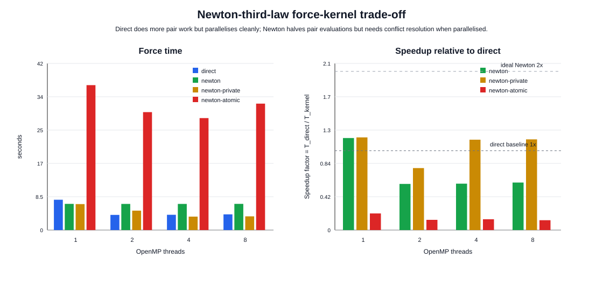
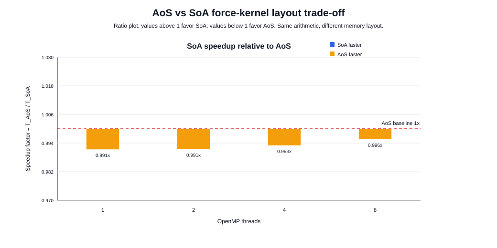
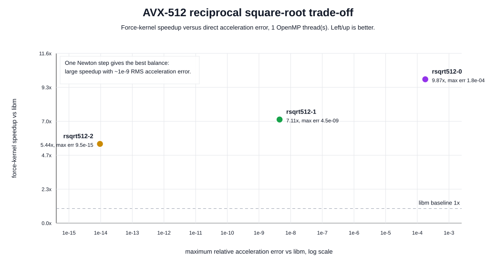
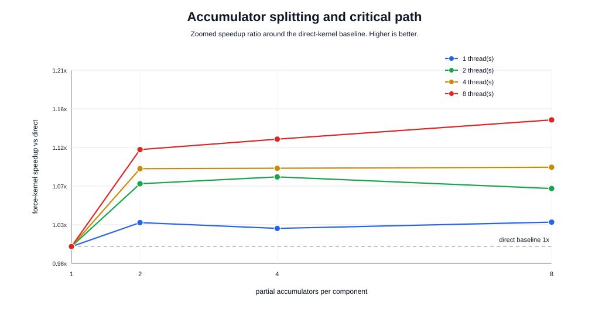
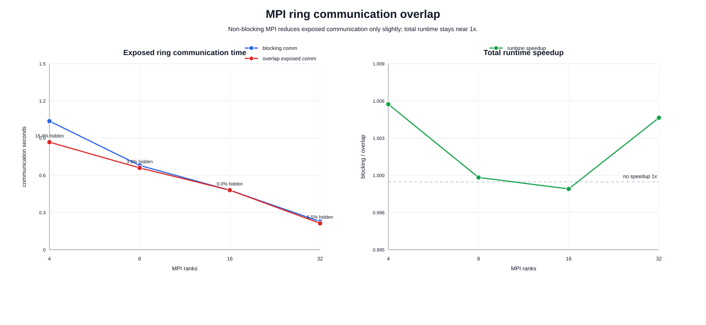
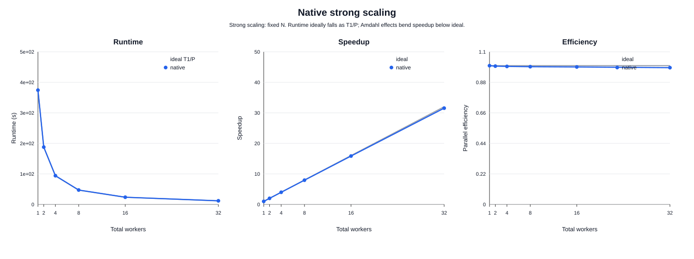
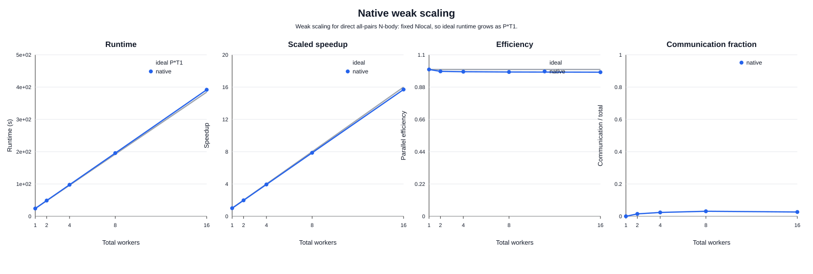
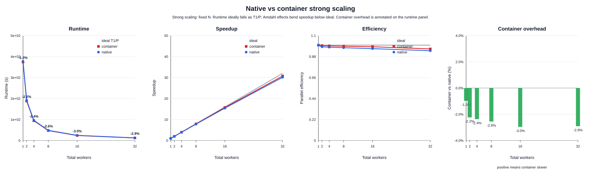
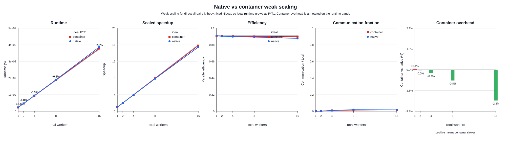
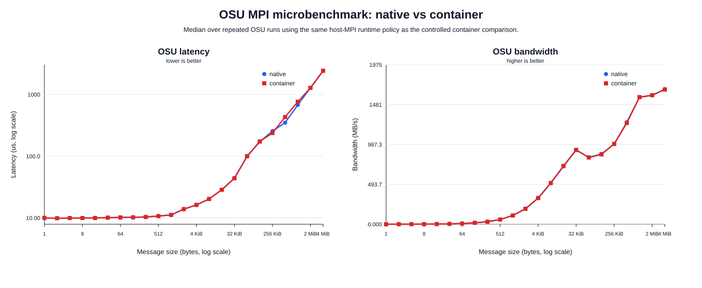

# HPC & Cloud Computing Report

## Exercise 1: Direct N-body Gravitational Simulation

Course: Data Science & AI    
Student: Elisabeth Imbalzano   
Student ID: SM3800119  
Exam session: 01/10/2026


## Abstract

This project investigates the implementation and performance optimization of a direct gravitational N-body simulation on a modern HPC system. The solver evaluates all pairwise gravitational interactions using a softened potential, resulting in an $O(N^2)$  computational kernel, and advances the system in time with a second-order Kick-Drift-Kick leapfrog integrator.

The implementation combines OpenMP shared-memory parallelism with an MPI ring-shift decomposition, allowing each process to retain ownership of its local particles while progressively exchanging source-particle blocks with the other ranks. Several kernel-level optimization strategies are evaluated, including Newton's third-law reuse, data-layout choices, reciprocal-square-root approximations, accumulator splitting, and communication-computation overlap.

Correctness is assessed independently of execution time through total-energy conservation, while performance is characterized through repeated measurements, strong and weak scaling, hybrid MPI/OpenMP mapping, and instrumented kernel timings. The final implementation is also evaluated inside a Singularity container to quantify launch, communication, and application-level overhead relative to native execution.

All final experiments were performed on the Orfeo HPC cluster using its AMD EPYC GENOA partition, since the originally targeted LEONARDO system was unavailable.


## 1. Introduction
Direct **N-body simulation** models the motion of particles interacting through mutual gravitational forces. Since each particle interacts with every other particle, direct force evaluation requires $O(N^2)$ interactions at each time step, making the problem computationally demanding for large systems.

Although more scalable approaches, such as tree-based methods, can reduce this complexity, this project focuses on the **direct formulation** because its regular computational structure provides a clear setting for studying high-performance computing techniques.

The work is organized around four main aspects:

1. **Numerical correctness**  
Verify that the simulation preserves the physical behaviour of the system through total-energy conservation.
2. **Computational optimization**  
Analyze the main computational bottleneck and evaluate different strategies to improve the performance of the force calculation.
3. **Parallel scalability**  
Use OpenMP and MPI to study shared- and distributed-memory parallelism, communication costs, hybrid configurations, and strong and weak scaling.
4. **Portability and containerization**  
Compare native and Singularity executions to evaluate the performance impact and portability of the containerized application.

The overall goal is to **measure and explain** how implementation, optimization, and runtime choices affect correctness, performance, scalability, and portability.


## 2. Physical Model and Numerical Method
### 2.1 Gravitational N-body Model

The system consists of **$N$ equal-mass particles** moving in three-dimensional space under mutual gravitational attraction and open boundary conditions.

Each particle $i$ is described by:

- **position** $\mathbf{x}_i$
- **velocity** $\mathbf{v}_i$
- **mass** $m$

In all final experiments, the particle mass is fixed to

$$
m=1.0,
$$

so the total mass of the system is $M=N$.

The equations of motion are

$$
 \frac{d\mathbf{x}_i}{dt}=\mathbf{v}_i, \qquad \frac{d\mathbf{v}_i}{dt}=\mathbf{a}_i. 
$$

The acceleration of particle $i$ is computed by summing the gravitational contribution of all the other particles:

$$ 
\mathbf{a}_i = Gm \sum_{j\neq i} \frac{\mathbf{x}_j-\mathbf{x}_i} {\left(|\mathbf{x}_j-\mathbf{x}_i|^2+\epsilon^2\right)^{3/2}}. 
$$

The parameter $\epsilon$ is the **gravitational softening length**.

Its role is to prevent the Newtonian force from becoming singular when two particles get extremely close. Without softening, the force would grow without bound as the distance approaches zero. With $\epsilon>0$, very close encounters remain finite and numerically manageable.

The same softening is also used in the potential energy,

$$ 
V = -\sum_{i<j} \frac{Gm^2} {\sqrt{|\mathbf{x}_i-\mathbf{x}_j|^2+\epsilon^2}}, 
$$

so the force computation and the energy diagnostic remain physically consistent.

### 2.2 Initial Conditions and Choice of Softening

The main initial condition used in the experiments is a **Plummer sphere**, a spherically symmetric self-gravitating particle distribution commonly used as a controlled test case.

The final experiments use:

$$
\text{softening length}\quad\epsilon=0.05, 
\qquad \text{and integration timestep}\quad\Delta t=10^{-4}.
$$

The value of $\epsilon$ controls how strongly close particle encounters are smoothed:

- **small $\epsilon$**
the interaction remains closer to the Newtonian force at short distances, but close encounters can produce very *large accelerations*. These rapid changes in the motion may require a *smaller timestep to maintain numerical stability and good energy conservation*;
- **large $\epsilon$**
the interaction becomes smoother and easier to integrate numerically, but *gravitational forces are weakened over a larger short-range region*. Therefore, increasing $\epsilon$ also *changes the physical dynamics represented by the model*.

A useful reference is the **typical distance between particles**,

$$ 
\ell \sim \frac{R}{N^{1/3}}, 
$$

where $R$ is the characteristic size of the system.

This estimate comes from assuming that $N$ particles occupy a volume of order $R^3$: the average volume per particle is then $R^3/N$, and its characteristic linear size is approximately $(R^3/N)^{1/3}$.

For the validation case with $N=10^4$ and $R\approx1$,

$$ 
\ell \approx 0.046, 
$$

which is close to the chosen value

$$ 
\epsilon=0.05. 
$$

Therefore, the selected softening acts on a scale comparable to the typical particle separation. This provides a practical compromise: it limits excessively strong close encounters without smoothing the gravitational interaction over much larger spatial scales.

Changing $\epsilon$ does **not change** the $O(N^2)$ cost of a single force evaluation, because every particle still interacts with every other particle.  
However, it can affect the **total simulation cost indirectly**. A smaller $\epsilon$ allows stronger close-range accelerations and faster changes in particle trajectories, which may require a smaller timestep to keep the integration stable and preserve energy conservation. Simulating the same physical time would then require *more integration steps and* therefore more $O(N^2)$ *force evaluations*.


### 2.3 Kick-Drift-Kick Leapfrog Integration

The system is advanced in time using a second-order **Kick-Drift-Kick (KDK) leapfrog integrator**.  
Each timestep $\Delta t$ is divided into three stages:

1. **First half kick $-$ update the velocity:**

    The current acceleration is used to advance the velocity by half a timestep

    $$ 
    \mathbf{v}\left(t+\frac{\Delta t}{2}\right) = \mathbf{v}(t) + \frac{\Delta t}{2}\mathbf{a}(t). 
    $$

2. **Drift $-$ update the position:**

    The intermediate velocity is then used to advance the particle positions over a full timestep

    $$ 
    \mathbf{x}(t+\Delta t) = \mathbf{x}(t) + \Delta t\, \mathbf{v}\left(t+\frac{\Delta t}{2}\right).
    $$

    Since the particles have moved, the gravitational ***forces** must be recomputed* at the new positions

    $$ 
    \mathbf{a}(t+\Delta t) = \mathbf{a}\!\left[\mathbf{x}(t+\Delta t)\right]. 
    $$

3. **Second half kick $-$ complete the velocity update:**

    The newly computed acceleration is used to advance the velocity by the remaining half timestep

    $$ 
    \mathbf{v}(t+\Delta t) = \mathbf{v}\left(t+\frac{\Delta t}{2}\right) + \frac{\Delta t}{2}\mathbf{a}(t+\Delta t). 
    $$

After these three stages, both positions and velocities are available at time $t+\Delta t$, and the procedure is repeated for the next timestep.

The KDK leapfrog method is **second-order, symplectic, and time-reversible**. These properties make it particularly suitable for gravitational simulations, because it provides good long-term behaviour and *limits artificial drift* in the system energy.


### 2.4 Energy Conservation as a Correctness Criterion

For an isolated gravitational system, the total mechanical energy should remain constant over time. Energy conservation therefore provides a simple physical criterion for checking that the numerical solver evolves the system correctly, independently of its execution time.

The total energy is
$$
E = T + V,
$$

where the kinetic energy is

$$
T = \frac{1}{2}
\sum_i m |\mathbf{v}_i|^2
$$

and $V$ is the softened gravitational potential defined previously.

Because numerical integration introduces small errors, the energy is *not expected to remain exactly constant*.  
The solver therefore monitors the **relative energy drift**

$$
\delta_E(t)
=
\frac{|E(t)-E(0)|}
{\max(|E(0)|,\mathrm{tiny})},
$$

which measures the relative change in total energy with respect to its initial value.

A small value of $\delta_E$ indicates that the numerical evolution remains close to the expected conservative behaviour.  
The **maximum drift** over the sampled simulation times is used as the **validation metric**.

The final validation run uses:

- $N=10\,000$ particles,
- $100$ KDK integration steps,
- timestep $\Delta t = 10^{-4}$,
- softening length $\epsilon = 0.05$,
- $8$ OpenMP threads,
- energy sampling every $10$ integration steps,
- validation tolerance $\delta_E^{\max}<10^{-4}$.

This validation is a correctness check rather than a statistical performance benchmark. For a fixed input and numerical configuration, the relevant quantity is the resulting energy drift; repeated timing runs are instead used in the performance sections to account for runtime noise.

| N | Steps | $\Delta t$ | $\epsilon$ | Threads | Integrator | Force kernel | inv sqrt | Total time (s) | Force time (s) | Energy time (s) | Max drift | Status |
|---:|---:|---:|---:|---:|:---|:---|:---|---:|---:|---:|---:|:---|
| 10000 | 100 | $10^{-4}$ | 0.05 | 8 | KDK | direct | libm | 4.910674 | 4.431348 | 0.447601 | $2.67\times10^{-7}$ | OK |

The measured maximum relative energy drift is

$$
\boxed{
\delta_E^{\max}
=
2.67\times10^{-7}
}
$$

which is well below the adopted validation threshold of $10^{-4}.$

This confirms that the numerical integration preserves the total mechanical energy with a large margin relative to the selected correctness threshold.


## 3. Parallel Implementation

This section describes how the direct N-body force computation is parallelized using **OpenMP**, **MPI**, and a hybrid combination of the two.

### 3.1 Data Layout

Particle data are stored using a Structure-of-Arrays (SoA) representation. Each physical quantity is kept in a separate contiguous array:

```text
x[0 ... N-1]
y[0 ... N-1]
z[0 ... N-1]

vx[0 ... N-1]
vy[0 ... N-1]
vz[0 ... N-1]

ax[0 ... N-1]
ay[0 ... N-1]
az[0 ... N-1]
```

This organization keeps together the values of the same physical quantity. During the force computation, the kernel mainly reads the position arrays and writes the acceleration arrays, without accessing unrelated velocity data.

SoA is also convenient for MPI communication, since particle coordinates are stored in contiguous arrays, and provides a data organization suitable for SIMD-oriented optimizations.

The production implementation uses SoA throughout. A controlled comparison with an Array-of-Structures (AoS) representation is presented later in the optimization experiments.

### 3.2 OpenMP Parallelization

Within a shared-memory node, OpenMP parallelizes the outer loop **over the target particles**.

Conceptually:

```text
parallel for each target particle i:
    ax_i = 0
    ay_i = 0
    az_i = 0

    for each source particle j:
        if i != j:
            compute interaction(i, j)
            accumulate into acceleration of i
```

Each OpenMP iteration is responsible for one target particle $i$. Therefore, **each thread** writes only to the accelerations of the particles assigned to it, while the source-particle positions are shared and read-only.

This makes the iterations independent and **avoids atomic** operations or other synchronization inside the force loop.

The drift and kick stages of the KDK integrator are also parallelized, but their $O(N)$ cost is much smaller than the $O(N^2)$ force computation.

### 3.3 MPI Ring Decomposition

For distributed-memory execution, the $N$ particles are divided into equal contiguous blocks across $P$ MPI ranks.

Each rank owns

$$
N_{\mathrm{local}}=\frac{N}{P}
$$

particles. These particles remain the rank's **local target particles** throughout the simulation.

However, each local target must interact with all $N$ particles in the system. To make every source particle available without storing the complete system on every rank, the implementation uses a ring communication pattern.

Each rank therefore works with:

- a fixed block of **local target particles**;
- a **source block** that moves between MPI ranks.

Initially, each rank uses its own local block as the source block. After computing those interactions, the source block is passed to the next MPI rank and a new block is received from the previous rank.

For $P$ ranks, the procedure is:

```text
for each ring phase:
    compute interactions between
        local targets
        and current source block

    send current source block to next rank
    receive next source block from previous rank
```

After $P$ phases, every rank has seen every source block. Therefore, each local target has interacted with all $N$ particles.

For four MPI ranks:

```text
phase 0:   R0 uses B0   R1 uses B1   R2 uses B2   R3 uses B3
phase 1:   R0 uses B3   R1 uses B0   R2 uses B1   R3 uses B2
phase 2:   R0 uses B2   R1 uses B3   R2 uses B0   R3 uses B1
phase 3:   R0 uses B1   R1 uses B2   R2 uses B3   R3 uses B0
```

The target particles never move between ranks: only the source blocks circulate around the ring.

As a consequence, *each rank remains the unique owner of the accelerations of its local particles, so no global reduction of the acceleration arrays is required* after the ring traversal.

The current implementation assumes that $N$ is divisible by the number of MPI ranks, which is sufficient for all benchmark configurations used in this work.

### 3.4 Hybrid MPI + OpenMP Execution

The MPI ring decomposition and OpenMP parallelization are combined in the hybrid solver.

The two levels have distinct roles:

- **MPI** divides the target particles among ranks and circulates the source blocks;
- **OpenMP** divides the local target particles among the threads of each rank.

Therefore, during each ring phase, a rank receives one source block and its OpenMP threads collaboratively compute the interactions between that block and the rank's local targets.

Conceptually:
```text
MPI rank owns a block of target particles

for each source block in the ring:
    OpenMP threads divide the local targets
    each thread computes interactions with the source block

    rotate the source block to the next MPI rank
```

The total number of cores can be distributed between MPI ranks and OpenMP threads in different ways. For example, the same hardware resources can be used with a small number of ranks and many threads per rank, or with many ranks and fewer threads.

These configurations change the balance between shared-memory computation, MPI communication, and NUMA locality. Their performance is compared experimentally later in the report.

### 3.5 Blocking and Non-Blocking Ring Communication

Two communication strategies are implemented for the MPI ring.

#### $-$ Blocking communication $-$

The reference implementation uses `MPI_Sendrecv`.

For each ring phase, the rank first computes the interactions with its current source block and then exchanges that block with its neighbours:

```text
compute using current source block
            ↓
exchange source blocks
            ↓
compute using next source block
```

The communication and computation therefore occur one after the other.

#### $-$ Non-blocking communication $-$

The non-blocking implementation uses `MPI_Irecv` and `MPI_Isend`.

The main idea is to *start the communication for the next ring phase while the rank is still computing the current one*.

Conceptually:
```text
start transfer of next source block
            ↓
compute using current source block
            ↓
wait only if communication is not finished
            ↓
continue with the received source block
```

Unlike a blocking call, `MPI_Isend` and `MPI_Irecv` return immediately, allowing the rank to continue computing while the data transfer progresses.

If the communication finishes before the current force computation, part or all of its cost is hidden behind useful computation. Before the received block can be used in the next phase, `MPI_Waitall` ensures that the transfer has completed.

The intended execution is therefore:

$$ 
\boxed{ \text{communication} \quad \text{overlaps with} \quad \text{force computation} } 
$$

rather than

$$
\boxed{ \text{force computation} \rightarrow \text{communication} }
$$

as in the blocking version.

However, non-blocking communication *does not guarantee complete overlap*. The actual benefit depends on factors such as message size, MPI progress, communication latency, and the amount of computation available while the transfer is in progress.

The *blocking implementation is therefore used as the reference*, while the non-blocking version is evaluated experimentally to determine how much communication can actually be hidden.


## 4. Experimental Setup and Methodology

All final experiments were performed on the Orfeo HPC cluster, using the `GENOA` CPU partition. The original assignment targeted LEONARDO; however, LEONARDO was not available, so the benchmark campaign was moved to Orfeo while preserving the required experimental methodology.

System information was collected directly inside a SLURM allocation on a GENOA compute node rather than on the login node. This is important because processor topology, NUMA configuration, available memory, and software modules may differ between login and compute nodes.

### 4.1 Hardware Platform

The GENOA node used for the experiments is based on two AMD EPYC 9374F processors.

| Component | Configuration |
|:---|:---|
| CPU | AMD EPYC 9374F 32-Core Processor |
| Operating system / kernel | Linux x86_64, kernel `6.13.12-200.fc41.x86_64` |
| Sockets | 2 |
| Cores per socket | 32 |
| Hardware threads per core | 1 |
| Physical cores / visible CPUs | 64 |
| SMT | Disabled / not exposed |
| NUMA domains | 8 |
| Cores per NUMA domain | 8 |
| Main memory | 503 GiB |
| Swap | none |
| SIMD / vector ISA support | AVX, AVX2, FMA, AVX-512 |

The NUMA layout recorded from the allocated compute node is:

| NUMA node | Logical CPUs | Memory size |
|---:|:---|---:|
| 0 | 0-7 | 64053 MB |
| 1 | 8-15 | 64508 MB |
| 2 | 16-23 | 64508 MB |
| 3 | 24-31 | 64437 MB |
| 4 | 32-39 | 64508 MB |
| 5 | 40-47 | 64508 MB |
| 6 | 48-55 | 64508 MB |
| 7 | 56-63 | 64480 MB |

 The `numactl -H` distance matrix reports distance: 10 within each NUMA domain, 12 between domains on the same socket, and 32 between domains on different sockets.
 
 This topology is relevant for the hybrid MPI/OpenMP experiments, because different rank/thread mappings affect both memory locality and the number of MPI ring participants. For this reason, one rank per socket, one rank per NUMA domain, and one rank per physical core are compared experimentally.


### 4.2 Software Environment

The final native experiments were performed using the following software environment:

| Component                    | Version             |
| :--------------------------- | :------------------ |
| C compiler                   | GCC 14.3.1          |
| MPI implementation           | Open MPI 4.1.6      |
| MPI compiler wrapper         | `mpicc`             |
| OpenMP runtime               | GNU `libgomp` (`libgomp.so.1`) |
| Container runtime            | SingularityCE 4.3.1 |
| Hardware-locality library    | hwloc 2.12.0        |
| GNU C library                | glibc 2.40          |
| External numerical libraries | none                |

The MPI executable is compiled through `mpicc`, the Open MPI compiler wrapper. It uses the underlying GCC compiler while automatically adding the MPI headers and libraries required for compilation and linking.

The force kernel is implemented directly in C and does not rely on BLAS or other external numerical libraries.

All final numerical experiments use double-precision arithmetic.

### 4.3 Compilation Configuration

The final native N-body benchmarks were built using double precision and OpenMP support. The reference build commands were:

```text
make OPENMP=1 PRECISION=double \
  CFLAGS="-O3 -march=native -ffp-contract=fast -Wall -Wextra -Wpedantic"
```
```text
make mpi OPENMP=1 PRECISION=double \
  CFLAGS="-O3 -march=native -ffp-contract=fast -Wall -Wextra -Wpedantic"
```

The first command builds the serial/OpenMP executables and microbenchmarks, while the second builds the MPI/OpenMP executable through `mpicc`.

The build configuration used for the final benchmarks is:

- `OPENMP=1`: enables OpenMP support where required;
- `PRECISION=double`: selects double-precision floating-point arithmetic.

The main compiler flags are:

- `-O3`: enables aggressive compiler optimizations;
- `-march=native`: optimizes the generated code for the GENOA processor used in the native experiments;
- `-ffp-contract=fast`: allows floating-point contraction, including fused multiply-add operations where applicable;
- `-Wall -Wextra -Wpedantic`: enable additional compiler warnings.

Depending on the selected target, the Makefile also adds:

- `-std=c11`: selects the C11 language standard;
- `-DNBODY_USE_DOUBLE`: selects the double-precision scalar type;
- `-fopenmp`: enables OpenMP compilation and linking.

#### Optional diagnostic flags

Additional compiler options were used only for specific diagnostic experiments and are not part of the standard benchmark build.

For the AoS/SoA layout experiment, compiler vectorization information was generated using:

```text
-fopt-info-vec-all=report/tables/layout_vec_all.txt
```

This produces a report indicating which loops were vectorized and which could not be vectorized.

No profile-guided or feedback-directed optimization was used.

#### Container compilation target

The containerized benchmarks use the same build configuration, except that:

```text
-march=x86-64-v3
```

is used instead of:

```text
-march=native
```

The reason is portability: `-march=native` generates code specifically for the processor used during compilation, whereas `x86-64-v3` defines a portable baseline that can run on a wider range of modern x86-64 processors.

The main difference is:

- `x86-64-v3`
  - provides a portable modern x86-64 baseline;
  - includes instructions such as AVX2 and FMA;
  - does not assume newer extensions such as AVX-512.
- `-march=native`
  - detects the exact GENOA processor;
  - enables the instruction-set extensions supported by that CPU;
  - allows GCC to apply more CPU-specific tuning and instruction scheduling.

Therefore, the *native* build can potentially exploit more *specialized hardware features*, while the *container* build prioritizes *portability*. The performance potentially left on the table by `-march=x86-64-v3` is the benefit of GENOA-specific code generation:

- wider SIMD code generation where the compiler can use AVX-512;
- instruction scheduling and tuning choices specialized for Zen 4;
- possible use of CPU-specific variants of arithmetic and vector operations;
- better exploitation of FMA/vector throughput in loops that are actually vectorized.

This potential loss is not the same for all parts of the program. In scalar or poorly vectorized loops, `-march=native` may provide only a small benefit. In vector-friendly kernels, especially the explicit AVX-512 reciprocal-square-root force kernel discussed in Section 6.3, the gap can be larger because `x86-64-v3` does not assume AVX-512 support.

The upper-bound theoretical penalty can be estimated from SIMD width. The portable `x86-64-v3` target guarantees AVX2, which operates on four double-precision values in a 256-bit vector. AVX-512 operates on eight double-precision values in a 512-bit vector. For an ideal kernel limited only by vector arithmetic throughput, the AVX2-width path could therefore provide at most about half the vector work per instruction:

$$
\frac{4\ \mathrm{FP64\ lanes}}{8\ \mathrm{FP64\ lanes}}
=
\frac{1}{2}.
$$

Equivalently, a perfectly vectorized AVX-512 implementation could be up to about

$$
2\times
$$

faster than a 256-bit AVX2-width implementation. This is only a ceiling estimate: it assumes that the kernel is fully vectorized, that vector arithmetic is the limiting factor, and that no other bottleneck dominates.

The correct way to measure this cost is to build the same source code with both targets and run the same benchmark configurations under the same MPI binding and transport policy:

```text
portable build: -O3 -march=x86-64-v3 -ffp-contract=fast
native build:   -O3 -march=native    -ffp-contract=fast
```

The comparison should report force time, `Ginteraction/s`, nominal GFLOP/s, and energy drift. If hardware counters are available, the measurement can be strengthened with SIMD/FMA instruction counters; otherwise, the combination of timing, derived throughput, and compiler vectorization reports is the available evidence. The native-versus-container timings in Section 8 include this compiler-target difference, so their overhead should be interpreted as a deployment-level comparison rather than the isolated cost of Singularity.

#### Measured impact of the portable target

To estimate this effect directly, the same $2\times32$ hybrid configuration was built and run twice on the GENOA node, changing only the compiler target.

| Target | Total median s | Force median s | Ginteraction/s | Max drift | Status |
|:---|---:|---:|---:|---:|:---|
| `-march=x86-64-v3` | 1.489180 | 1.284213 | 17.558 | $2.549735\times10^{-7}$ | OK |
| `-march=native` | 1.356827 | 1.208716 | 18.654 | $2.549735\times10^{-7}$ | OK |

The native target improves total runtime by

$$
\frac{1.489180}{1.356827}
\approx
1.098,
$$

and force-kernel throughput by

$$
\frac{18.654}{17.558}
\approx
1.062.
$$

In this controlled check, the portable `x86-64-v3` target leaves approximately $6\%$ force-kernel throughput and approximately $9\%$ total-runtime performance on the table, while preserving the same numerical result. The gap is moderate rather than dramatic, which is consistent with the earlier vectorization analysis: architecture-specific code generation helps, but the complete solver is still limited by the structure of the force kernel rather than by SIMD peak throughput alone.

The measured gap is much smaller than the theoretical $2\times$ SIMD-width ceiling because the complete solver is not an ideal dense vector-FMA workload. Parts of the force kernel are limited by inverse-distance evaluation, accumulator dependencies, control flow, memory access, and MPI/OpenMP overhead. The gap could become larger for a more explicitly vectorized production kernel, while it would remain small for scalar or poorly vectorized code.


### 4.4 Parallel Execution Configuration

Parallel executions were launched through SLURM using `srun`.

Each configuration is identified by:
- $P$: number of MPI ranks;
- $T$: number of OpenMP threads per rank;
- $W=P\times T$: total number of workers.

For example, a $2\times32$ configuration uses 2 MPI ranks with 32 OpenMP threads per rank, for a total of 64 workers.

The general execution command is

```text
srun -n <ranks> -c <threads> ./nbody_mpi_omp [solver options]
```

where:
- `-n` sets the number of MPI ranks;
- `-c` allocates the CPUs required by each rank.

Since SMT is not exposed on the GENOA node, one allocated CPU corresponds to one physical core.

#### OpenMP thread placement
Within each MPI rank, OpenMP thread placement is controlled using

```text
OMP_NUM_THREADS=<threads>
OMP_PLACES=cores
OMP_PROC_BIND=close
```

with the following roles:
- `OMP_NUM_THREADS` sets the number of threads created by each rank;
- `OMP_PLACES=cores` places threads on physical cores;
- `OMP_PROC_BIND=close` keeps the threads of the same rank close to each other within the allocated cores.

MPI rank placement itself is handled by the SLURM `srun` allocation; no additional `mpirun --bind-to` option is used.

#### Verified hybrid mappings

The actual CPU affinity of each MPI rank was explicitly checked inside the SLURM allocation using taskset `-pc`.

The observed mappings were:
| Configuration | Observed affinity                                | Physical interpretation        |
| :------------ | :----------------------------------------------- | :----------------------------- |
| $2\times32$ | rank 0: CPUs 0-31; rank 1: CPUs 32-63            | one MPI rank per socket        |
| $8\times8$  | one 8-core block per rank: 0-7, 8-15, ..., 56-63 | one MPI rank per NUMA domain   |
| $64\times1$ | one distinct CPU per rank                        | one MPI rank per physical core |

These checks confirm that the three hybrid configurations correspond to the intended hardware mappings:

$$ 2\times32 \rightarrow \text{rank per socket} $$
$$ 8\times8 \rightarrow \text{rank per NUMA domain} $$
$$ 64\times1 \rightarrow \text{rank per core} $$

The numerical MPI rank order is not always identical to the NUMA-domain order, but the observed affinity masks confirm that the physical placement is correct.

#### MPI runtime policy

For the controlled native-versus-container experiments, both executions use the same explicit Open MPI runtime policy so that the communication environment is as comparable as possible. The exact settings are described in Section 8.1.

Native-only experiments instead use the *default host MPI* transport unless otherwise stated.

For every benchmark, the number of MPI ranks, OpenMP threads per rank, and total workers are recorded together with the performance measurements.


### 4.5 Benchmark Configurations

The final benchmark campaign includes a set of experiments designed to evaluate numerical correctness, kernel performance, communication behaviour, and parallel scalability.

#### Main application benchmarks

| Experiment        | Problem size                | Steps | Parallel configuration               |
| :---------------- | :-------------------------- | ----: | :----------------------------------- |
| Energy validation | $N=10\,000$               |   100 | 8 OpenMP threads                     |
| Complexity growth | $N=1\,000,\;10\,000$      |    50 | 1 OpenMP thread                      |
| Hybrid mapping    | $N=32\,768$               |    20 | $2\times32,\;8\times8,\;64\times1$ |
| MPI overlap       | $N=32\,768$               |    20 | 4, 8, 16, 32 MPI ranks               |
| Strong scaling    | $N=32\,768$               |   100 | 1, 2, 4, 8, 16, 32 MPI ranks         |
| Weak scaling      | $N_{\mathrm{local}}=8192$ |   100 | 1, 2, 4, 8, 16 MPI ranks             |

#### Kernel optimization benchmarks
The kernel-level experiments use dedicated configurations chosen to isolate specific implementation effects:

| Experiment | Problem size | Execution type |
|:---|:---|:---|
| Newton's third law | $N=8192$, 20 KDK steps | Full solver |
| Reciprocal square root | $N=8192$, 20 KDK steps | Full solver |
| Accumulator splitting | $N=8192$, 20 KDK steps | Full solver |
| AoS vs SoA layout | $N=16\,384$ | Force-kernel microbenchmark |

The three full-solver optimization experiments use the same $N=8192$ configuration to make their performance results directly comparable. The AoS/SoA test instead uses a dedicated force-kernel microbenchmark, since its purpose is to isolate a specific layout property rather than measure the complete N-body simulation.

#### Common numerical parameters
Unless otherwise stated, the time-integration benchmarks use:

| Parameter                     | Value            |
| :---------------------------- | :--------------- |
| Initial condition             | Plummer sphere   |
| Random seed                   | 123              |
| Plummer scale parameter       | 1.0              |
| Timestep $\Delta t$         | $10^{-4}$      |
| Softening length $\epsilon$ | 0.05             |
| Arithmetic precision          | double precision |

The dedicated correctness test uses the validation criterion 

$$
\delta_E^{max}\le 10^{-4}
$$,   
with energy sampled every 10 integration steps, as described in Section 2.4.
For the performance experiments, energy is evaluated only at the end of the run by setting

```text
--energy-every = nsteps
```

so that the diagnostic introduces minimal additional overhead. The default solver threshold 
```text
--energy-tol 1e-3
```
is used only as a runtime warning threshold in these runs and is not the correctness criterion adopted for validation.

#### Adaptation to the available resources

The scaling problem sizes are smaller than those suggested in the original assignment. The reference configuration proposed approximately

$$
N=10^5
$$

for strong scaling and

$$
N/P=10^4
$$

for weak scaling.

These sizes were not practical under the available Orfeo allocation, where jobs on the GENOA partition were limited to a maximum wall time of two hours.

The final campaign therefore uses:

- $N=32\,768$ for strong scaling;
- $N_{\mathrm{local}}=8192$ for weak scaling.

With 16 MPI ranks, the largest weak-scaling case therefore reaches

$$ 
N=16\times8192=131\,072. 
$$

These reduced sizes preserve the structure of the requested scaling experiments while keeping the complete benchmark campaign feasible within the available resource limits.


### 4.6 Measurement and Statistical Methodology

To obtain reproducible performance measurements, the same methodology is used throughout the benchmark campaign unless otherwise stated.

#### Repeated measurements
- Unless otherwise stated, each benchmark configuration is executed *five times* with the same numerical parameters and parallel setup.
- The **median** execution time is used as the representative value, since it is less sensitive to occasional system noise than the arithmetic mean.
- Run-to-run variability is reported using the **sample standard deviation**.
- No repetitions are removed as outliers, and no dedicated warm-up run is discarded.

#### Timing scope

Compilation and initial-condition generation are performed before the benchmark runs and are therefore excluded from the reported execution times.

The solver provides timing instrumentation for the main execution phases:

| Timing component       | Meaning                                                                                                                          |
| :--------------------- | :-------------------------------------------------------------- |
| **Kick time**          | Velocity-update operations of the KDK integrator                |
| **Drift time**         | Position-update operations of the KDK integrator                |
| **MPI communication**  | Exposed time spent in ring communication; in the non-blocking implementation, this represents the communication time not hidden by concurrent force computation. |
| **Initial force**      | First complete force evaluation, performed before the KDK time-stepping loop |
| **Energy diagnostics** | Computation of kinetic and potential energy for energy-conservation checks   |
| **Force time**         | All gravitational force evaluations, including the initial force and the force evaluations performed during the KDK steps |
| **Integration time**   | Complete KDK time-stepping loop, including kick, drift, per-step force evaluations, and diagnostics performed during integration |
| **Total time**         | Complete timed simulation; the broadest application-level timing              |

These timers are not all mutually exclusive. For example, MPI communication is part of the distributed force evaluation, while kick, drift, and per-step force evaluations occur inside the integration loop. They are therefore used to identify the cost of individual execution phases rather than summed to reconstruct the total runtime.


## 5. Baseline Characterization

Before introducing kernel optimizations and parallel scaling, the baseline solver is characterized from three complementary viewpoints:

1. numerical correctness;
2. expected $O(N^2)$ computational growth;
3. distribution of the runtime among the main execution phases.

These measurements establish the reference behaviour of the implementation before optimization.


### 5.1 Numerical Correctness

$$ \boxed{\text{Is it correct?}} $$

The numerical validation procedure is described in Section 2.4.

For the reference Plummer-sphere test, the measured maximum relative energy drift is

$$
\delta_E^{\max}=2.67\times10^{-7},
$$

well below the adopted validation threshold

$$ 10^{-4}. $$

The baseline implementation therefore satisfies the required energy-conservation criterion and provides a numerically valid reference for the following performance experiments.

### 5.2 Verification of $O(N^2)$ Computational Growth

The direct force computation evaluates all ordered particle pairs except self-interactions, giving

$$
N(N-1)
$$

interactions per force evaluation.
Therefore, if the number of particles is increased by a factor of 10, the time spent in one force evaluation, and consequently the force time per integration step, is expected to grow by approximately a factor of

$$
10^2 = 100.
$$

More precisely, because self-interactions are skipped, the expected interaction-count ratio from $N=1\,000$ to $N=10\,000$ is

$$
\frac{10000(10000-1)} {1000(1000-1)} = 100.090.
$$

To verify this experimentally, two problem sizes were executed for 50 integration steps using one OpenMP thread:

|       $N$ | Force time (s) | Force time per step (s) |
| ----------: | -------------: | ----------------------: |
|  $1\,000$ |       0.180952 |                0.003619 |
| $10\,000$ |      18.124287 |                0.362486 |

The measured force-time-per-step ratio is

$$
\frac{0.362486}{0.003619} \approx 100.16.
$$

Therefore,

$$
\text{theoretical ratio}=100.09, \qquad \text{measured ratio}\approx100.16.
$$

The measured growth is therefore essentially the expected factor of $100$. The small difference between $100.09$ and $100.16$ is due to measurement noise, finite-size effects, cache behaviour, and the fact that the exact operation count is $N(N-1)$ rather than exactly $N^2$.

The result agrees with the direct-summation model: increasing $N$ by a factor of 10 makes each particle interact with 10 times more sources and also increases the number of target particles by 10, so the total pair work grows by about $10\times10=100$. This confirms that the dominant force computation follows the expected $O(N^2)$ growth.

### 5.3 Runtime Bottleneck

$$ \boxed{\text{Where is the time spent?}} $$

The timing instrumentation introduced in Section 4.6 is used to determine where the baseline execution time is spent.

For the $N=10\,000$, 100-step reference run:

| Component          |         Time (s) | Fraction of total |
| :----------------- | ---------------: | ----------------: |
| Force evaluation   |         4.431348 |             90.2% |
| Energy diagnostics |         0.447601 |              9.1% |
| Other operations   | $\approx0.032$ |               <1% |
| **Total**          |     **4.910674** |          **100%** |

Approximately $90\%$ of the execution time is spent evaluating gravitational forces.

This is consistent with the structure of the solver:

- **force evaluation**: $O(N^2)$, since every target interacts with every source;
- **kick and drift**: $O(N)$, since each particle is updated once;
- **energy diagnostics**: also involve pairwise interactions, but are evaluated only periodically.

The direct force kernel is therefore the main computational bottleneck of the baseline implementation and becomes the primary target of the optimization study in the following section.

## 6. Kernel-Level Optimization Study

The baseline analysis identified the direct force kernel as the dominant computational cost. This section therefore investigates how different implementation choices affect its performance.

Four aspects are studied:
- **Newton's third law** $-$ reduce the number of pair evaluations;
- **AoS vs SoA layout** $-$ evaluate the effect of particle-data organization;
- **reciprocal square root** $-$ investigate the cost of the inverse-distance calculation;
- **accumulator splitting** $-$ reduce dependency chains in force accumulation. 

Each experiment isolates one specific optimization trade-off. The corresponding benchmark configurations are summarized in Section 4.5.


### 6.1 Newton's Third Law

The baseline force kernel evaluates both ordered interactions $(i,j)$ and $(j,i)$. 

Using Newton's third law, each pair can instead be evaluated once,

$$
i<j,
$$

and the equal and opposite force contributions are applied to both particles. This reduces the number of pair evaluations from approximately

$$
N(N-1)
$$

to

$$
\frac{N(N-1)}{2}.
$$

The *potential arithmetic saving* is therefore close to $2\times$.  

The main difficulty is parallel force ownership:
- **direct kernel**: each thread updates only its own target acceleration $\mathbf a_i$;
- **Newton reuse**: each pair updates both $\mathbf a_i$ and $\mathbf a_j$, creating possible write conflicts between threads.  

Four implementations were compared:

| Kernel | Pair traversal | Update strategy |
|:---|:---|:---|
| `direct` | ordered pairs | independent target ownership |
| `newton` | $i<j$ | serial, conflict-free |
| `newton-private` | $i<j$ | OpenMP with thread-private acceleration buffers and final reduction |
| `newton-atomic` | $i<j$ | parallel updates protected by atomics |

The `newton-private` implementation is the non-atomic conflict-resolution experiment: each OpenMP thread accumulates into private acceleration arrays and the final acceleration is obtained by reducing the thread-local arrays. This removes write conflicts from the pair loop, at the cost of additional memory traffic, buffer initialization, and a final reduction.

The `newton-atomic` implementation is included only as a *diagnostic negative case*: it is correct, but it measures the cost of solving the same race condition through fine-grained atomic updates.

The experiment uses $N=8192$, 20 KDK steps, and five repetitions per configuration.

| Threads | `direct` (s) | `newton` (s) | `newton-private` (s) | `newton-atomic` (s) |
|---:|---:|---:|---:|---:|
| 1 | $7.708523 \pm 0.013313$ | $6.645661 \pm 0.006854$ | $6.601909 \pm 0.007602$ | $36.815682 \pm 0.021395$ |
| 2 | $3.855941 \pm 0.013133$ | $6.634327 \pm 0.002160$ | $4.936098 \pm 0.004779$ | $29.960169 \pm 0.860734$ |
| 4 | $3.881073 \pm 0.024460$ | $6.638978 \pm 0.002180$ | $3.408587 \pm 0.014212$ | $28.443824 \pm 0.365154$ |
| 8 | $3.984457 \pm 0.010679$ | $6.655043 \pm 0.016620$ | $3.487197 \pm 0.027073$ | $32.123918 \pm 0.358203$ |

The `newton` kernel is serial in the pair loop, so its runtime is expected to remain approximately constant when the requested OpenMP thread count changes.



#### Main observations

- **Serial Newton reuse is effective.**  
  With one thread, the force time decreases from $7.71$ s to $6.65$ s:
  $$
  \frac{7.708523}{6.645661}\approx1.16\times.
  $$
  The speedup is lower than the ideal $2\times$ because only the pair-evaluation work is halved; loop overhead, memory operations, and the two acceleration updates per pair remain.
- **The serial Newton kernel does not benefit from additional threads.**  
  Its runtime remains close to $6.6$ s, because the pair loop itself is not parallelized.
- **The private-buffer Newton variant resolves the race without atomics, but the gain is modest.**  
  `newton-private` is faster than `direct` at 1, 4, and 8 threads, with a maximum measured speedup of about
  $$
  \frac{7.708523}{6.601909}\approx1.17\times
  $$
  at one thread. At 4 and 8 threads, the speedup is approximately $1.14\times$. This is far below the ideal $2\times$ because the private-buffer method adds buffer zeroing, extra memory traffic, and a final reduction over the thread-local acceleration arrays.
- **The two-thread `newton-private` result exposes load imbalance in the triangular pair loop.**  
  With `schedule(static)`, the Newton loop assigns much more work to the lower-$i$ part of the iteration space. With two threads, the first static block contains about three quarters of all pairs, so the measured runtime,
  $$
  4.936\ \mathrm{s},
  $$
  is close to
  $$
  0.75\,T_{\mathrm{newton}}\approx0.75\times6.63\ \mathrm{s}\approx4.97\ \mathrm{s}.
  $$
  The arithmetic saving is therefore not sufficient to beat the cleaner `direct` kernel at two threads.
- **Atomic conflict resolution is prohibitively expensive.**  
  `newton-atomic` is much slower than all other variants, because the synchronization and cache-coherence cost of repeated atomic updates overwhelms the arithmetic saved by halving the pair count.

At eight threads:
$$
T_{\mathrm{direct}}=3.98\ \mathrm{s},
\qquad
T_{\mathrm{private}}=3.49\ \mathrm{s},
\qquad
T_{\mathrm{atomic}}=32.12\ \mathrm{s}.
$$

The non-atomic private-buffer strategy is therefore slightly faster than the clean direct kernel at 8 threads, while the atomic variant is about an order of magnitude slower.

#### Trade-off interpretation

The benefit of Newton reuse depends on the balance between the arithmetic saved and the cost introduced by concurrent force updates.

Newton's third law is advantageous when:
- the conflict-resolution mechanism is inexpensive;
- the pair loop is well balanced across threads;
- the cost of private-buffer initialization and reduction is small compared with the force computation;
- the problem is large enough for these additional costs to be amortized.

Under these conditions, evaluating only

$$
\frac{N(N-1)}{2}
$$

pairs can compensate for the additional synchronization or reduction work.

In the present experiments, this is approximately the case for the private-buffer implementation at 4 and 8 threads, where Newton reuse gives a modest speedup of about $1.14\times$.

The optimization becomes ineffective when the overhead introduced to resolve the write conflicts is comparable to, or larger than, the arithmetic saved. This occurs with:
- fine-grained atomic updates, because of synchronization and cache-coherence costs;
- poorly balanced triangular work distribution;
- large private-buffer memory traffic and reduction costs;
- configurations where the direct target-ownership kernel already parallelizes efficiently.

The measured results illustrate both regimes:

```text
few pair evaluations
        +
low conflict-resolution cost
        ↓
Newton reuse can be beneficial


few pair evaluations
        +
high synchronization / reduction / imbalance cost
        ↓
the arithmetic saving is lost
```

#### Conclusion

The experiment highlights a key trade-off:

$$
\boxed{
\text{reducing arithmetic work does not necessarily improve parallel performance}
}
$$

The measurements show that Newton reuse can provide a moderate benefit when write conflicts are resolved without fine-grained synchronization. The `newton-private` implementation demonstrates this regime, while the atomic variant shows that synchronization overhead can completely outweigh the arithmetic saving.

For the production solver, the direct target-ownership formulation is nevertheless retained because it provides simpler and more predictable parallel execution: each thread owns its target accelerations, no shared writes occur in the inner loop, and the same ownership model maps naturally to the MPI ring decomposition. The `newton-private` variant is therefore retained as the explicit trade-off experiment rather than as the production implementation.


### 6.2 AoS versus SoA

The experiment compares two representations of the same particle data:

```text
AoS:
particle[i] = {x, y, z, vx, vy, vz, ax, ay, az}
```
```text
SoA:
x[]  y[]  z[]
vx[] vy[] vz[]
ax[] ay[] az[]
```

In **AoS**, all quantities belonging to one particle are stored together, while in **SoA** each physical quantity is stored in a separate contiguous array.

The production solver uses SoA. To isolate the effect of data organization, the same force computation was benchmarked with both layouts.

The experiment uses $N=16\,384$ and 1, 2, 4, and 8 OpenMP threads. Force times are reported as median $\pm$ sample standard deviation over five repetitions.

The SoA speedup is defined as

$$
S_{\mathrm{SoA}}
=
\frac{T_{\mathrm{AoS}}}{T_{\mathrm{SoA}}},
$$
so $S_{\mathrm{SoA}}>1$ favors SoA, while $S_{\mathrm{SoA}}<1$ favors AoS.

| Threads | AoS force time (s) | SoA force time (s) | SoA speedup |
|---:|---:|---:|---:|
| 1 | $0.903034 \pm 0.000151$ | $0.910895 \pm 0.000439$ | 0.991 |
| 2 | $0.451970 \pm 0.000151$ | $0.455871 \pm 0.001764$ | 0.991 |
| 4 | $0.226311 \pm 0.000205$ | $0.227897 \pm 0.001877$ | 0.993 |
| 8 | $0.115289 \pm 0.001032$ | $0.115800 \pm 0.025404$ | 0.996 |




#### Main observations
- **No measurable SoA speedup is observed.**  
  The median difference remains below approximately $1\%$ for every thread count.
- **Both layouts scale similarly with OpenMP.**  
  Their force times decrease at nearly the same rate as the number of threads increases.
- **The 8-thread SoA measurement shows higher variability.**  
  Its standard deviation is larger than in the other cases, but the median remains very close to the corresponding AoS result.
- The computed accelerations agree within the numerical tolerance, confirming that the two implementations perform the same calculation.

To *investigate* why SoA does not provide the expected SIMD-related benefit, GCC vectorization diagnostics were inspected. Since hardware-counter tools such as `perf` and PAPI were not available on Orfeo, the analysis relies on measured timings and compiler reports.

The relevant GCC output includes:
```text
benchmark_layout.c:116:29: missed: couldn't vectorize loop
benchmark_layout.c:116:29: missed: not vectorized: unsupported control flow in loop.
nbody_common.h:81:10: missed: statement clobbers memory: ... sqrt(...)

benchmark_layout.c:159:29: missed: couldn't vectorize loop
benchmark_layout.c:159:29: missed: not vectorized: unsupported control flow in loop.
nbody_common.h:81:10: missed: statement clobbers memory: ... sqrt(...)
```

The dominant inner force loop is therefore not effectively vectorized in either layout. The reported obstacles include the self-interaction control flow and the scalar square-root path.

#### Interpretation

The result does **not** imply that AoS and SoA are generally equivalent.  
Rather, it shows that changing the memory layout alone provides little benefit when the computation that should exploit contiguous SoA data is not vectorized.  
In this implementation,

$$
\boxed{
\text{SoA layout alone does not guarantee SIMD speedup}
}
$$

The production solver nevertheless retains SoA because it:
- separates the data streams used by the force kernel;
- provides contiguous arrays convenient for MPI block communication;
- remains a suitable layout for future SIMD-oriented optimization.


### 6.3 Reciprocal Square Root

The gravitational force repeatedly requires the evaluation of

$$
\frac{1}{\sqrt{x}},
\qquad
x=r^2+\epsilon^2.
$$

which is then used to compute

$$
\frac{1}{(r^2+\epsilon^2)^{3/2}}
=
\left(\frac{1}{\sqrt{r^2+\epsilon^2}}\right)^3.
$$

The reference force kernel evaluates the inverse square root through the standard double-precision mathematical-library path:

```text
invr = 1.0 / sqrt(r2);
```

A faster alternative is the hardware **reciprocal-square-root estimate** (`rsqrt`), which directly approximates

$$
\frac{1}{\sqrt{x}}.
$$

The raw estimate is fast but approximate. Its accuracy can be improved through **Newton-Raphson refinement**:

$$
y_{k+1}
=
y_k
\left(
\frac{3}{2}
-
\frac{1}{2}xy_k^2
\right),
\qquad
y_k \approx \frac{1}{\sqrt{x}}.
$$

Each refinement reduces the approximation error but introduces additional arithmetic. The optimization therefore presents a direct **speed-accuracy trade-off**.

#### 6.3.1 AVX-512 force-kernel implementation

Since the solver uses double precision and the GENOA processors support AVX-512, the optimization was implemented directly inside an AVX-512 force kernel.

The tested kernels are:

| Variant | Implementation |
|:---|:---|
| `libm` | baseline kernel using `1.0 / sqrt(r2)` |
| `rsqrt512-0` | AVX-512 `_mm512_rsqrt14_pd` estimate |
| `rsqrt512-1` | AVX-512 estimate + one Newton refinement |
| `rsqrt512-2` | AVX-512 estimate + two Newton refinements |

A 512-bit vector operates on eight double-precision elements at a time. Therefore, the optimized variants combine two effects:

```text
AVX-512 vectorization of source interactions
                    +
hardware reciprocal-square-root estimate
                    +
optional Newton refinement
```
The measured performance gain must therefore be interpreted as the benefit of the complete AVX-512 force kernel, not as the isolated speedup of the `rsqrt` instruction.

#### 6.3.2 Performance results

The speedup is computed from the median force time:

$$
S =
\frac{T_{\mathrm{libm}}}{T_{\mathrm{variant}}}.
$$

| Threads | Variant | Force time (s) | Speedup vs `libm` | Max energy drift |
|---:|:---|---:|---:|---:|
| 1 | `libm` | $4.830180 \pm 0.001303$ | 1.000 | $4.083561\times10^{-8}$ |
| 1 | `rsqrt512-0` | $0.489470 \pm 0.000955$ | 9.868 | $2.510935\times10^{-8}$ |
| 1 | `rsqrt512-1` | $0.679676 \pm 0.000580$ | 7.107 | $4.083666\times10^{-8}$ |
| 1 | `rsqrt512-2` | $0.888685 \pm 0.001442$ | 5.435 | $4.083561\times10^{-8}$ |
| 8 | `libm` | $0.629055 \pm 0.002645$ | 1.000 | $4.083561\times10^{-8}$ |
| 8 | `rsqrt512-0` | $0.077441 \pm 0.001301$ | 8.123 | $2.510935\times10^{-8}$ |
| 8 | `rsqrt512-1` | $0.101999 \pm 0.002625$ | 6.167 | $4.083666\times10^{-8}$ |
| 8 | `rsqrt512-2` | $0.127204 \pm 0.001675$ | 4.945 | $4.083561\times10^{-8}$ |




#### Main observations
- **All AVX-512 variants substantially outperform the libm baseline.**  
  With one thread, rsqrt512-1 reduces force time from $4.830$ s to $0.680$ s, corresponding to a $7.107\times$ speedup. At eight threads, the same variant remains $6.167\times$ faster.
- **The raw estimate gives the highest performance.**  
  rsqrt512-0 reaches $9.868\times$ speedup with one thread, while each additional Newton refinement progressively increases the arithmetic cost.
- **The gain is larger than a simple inverse-square-root replacement would suggest.**  
  This is because the optimized implementation combines a cheaper reciprocal-square-root path with explicit AVX-512 vectorization of the source loop.

The result therefore represents a **force-kernel SIMD speedup**, rather than the isolated speedup of `rsqrt` alone.


#### 6.3.3 Accuracy against the `libm` force

Energy conservation is an application-level diagnostic, but it does not directly quantify the error introduced by the approximate force evaluation.

The acceleration field produced by each AVX-512 variant was therefore compared particle by particle with the `libm` reference.

For particle $i$,

$$
e_i =
\frac{
\left\|\mathbf{a}_i^{\mathrm{variant}}-\mathbf{a}_i^{\mathrm{libm}}\right\|_2
}{
\max\left(\left\|\mathbf{a}_i^{\mathrm{libm}}\right\|_2,\mathrm{tiny}\right)
}.
$$

The maximum relative error measures the worst particle-level deviation, while the RMS value represents the typical error over the complete system.

| Variant | Max relative accel error | RMS relative accel error | Max absolute accel error |
|:---|---:|---:|---:|
| `libm` | $0$ | $0$ | $0$ |
| `rsqrt512-0` | $1.784036\times10^{-4}$ | $2.754831\times10^{-5}$ | $1.218147\times10^{-1}$ |
| `rsqrt512-1` | $4.469061\times10^{-9}$ | $1.756846\times10^{-9}$ | $7.999740\times10^{-6}$ |
| `rsqrt512-2` | $9.545605\times10^{-15}$ | $2.527717\times10^{-15}$ | $2.415651\times10^{-11}$ |


#### Main observations
- **The unrefined estimate is fast but visibly approximate.**  
  Its maximum relative acceleration error is approximately
  $$
  1.8\times10^{-4}.
  $$
- **One Newton refinement recovers most of the required accuracy.**  
  The maximum relative error decreases to
  $$
  4.47\times10^{-9},
  $$
  while retaining most of the performance gain.
- **A second refinement reaches near-libm numerical agreement.**  
  The maximum relative error decreases to approximately
  $$
  10^{-14},
  $$
  but at additional computational cost.

The first Newton refinement therefore provides most of the useful accuracy recovery. The second refinement further improves numerical agreement, but this additional precision does not produce a visible advantage in the energy behaviour examined below.

#### 6.3.4 Energy Diagnostic and Timestep Sensitivity

The energy-conservation diagnostic must remain **sensitive to the numerical integration error** rather than being limited by a fixed error introduced by the approximate reciprocal square root.

If the `rsqrt` approximation dominated the diagnostic, reducing the timestep would have little effect on the measured energy drift. Conversely, if the drift decreases when $\Delta t$ is reduced, the diagnostic is still responding to the KDK integration.

The final candidate, `rsqrt512-1`, was therefore compared with `libm` at two timesteps while keeping the same physical final time.

| Kernel | $\Delta t$ | Steps | Physical time | Max energy drift |
|:---|---:|---:|---:|---:|
| `libm` | $10^{-4}$ | 20 | $2.0\times10^{-3}$ | $1.913904978\times10^{-7}$ |
| `libm` | $5\times10^{-5}$ | 40 | $2.0\times10^{-3}$ | $7.599504748\times10^{-8}$ |
| `rsqrt512-1` | $10^{-4}$ | 20 | $2.0\times10^{-3}$ | $1.913901028\times10^{-7}$ |
| `rsqrt512-1` | $5\times10^{-5}$ | 40 | $2.0\times10^{-3}$ | $7.599440426\times10^{-8}$ |

For a second-order KDK integrator, the timestep-dependent integration error is expected to decrease as $\Delta t$ is reduced. The maximum sampled energy drift is not expected to decrease by exactly a factor of four in this finite simulation; the relevant diagnostic is whether it responds consistently to the timestep.

#### Main observations
- **Halving the timestep reduces the energy drift for both kernels.**
- **`libm` and `rsqrt512-1` produce essentially identical drift values at both timesteps.**
- **The direct force error of `rsqrt512-1` is already very small**, with an RMS relative acceleration error of
  $$
  1.76\times10^{-9}.
  $$
These results show that the energy diagnostic is **not saturated by the `rsqrt` approximation**. It continues to respond to the integration timestep, while `rsqrt512-1` follows essentially the same energy-conservation behaviour as the `libm` reference.
The two accuracy checks therefore provide complementary information:

```text
direct acceleration comparison
→ measures the rsqrt force error directly

timestep sensitivity
→ verifies that the energy drift still
  responds to the KDK integration
```

Thus, after one Newton refinement, the reciprocal-square-root approximation is sufficiently accurate for the energy diagnostic to remain a meaningful test of the integrator.


#### Conclusion
The experiment exposes a clear performance-accuracy trade-off.

`rsqrt512-0` provides the highest throughput but introduces a visible force approximation error. Two Newton refinements recover near-libm numerical accuracy, but at additional computational cost.

The intermediate `rsqrt512-1` variant provides the best measured compromise: it preserves a large AVX-512 force-kernel speedup, reduces the relative acceleration error to the $10^{-9}$ range, and reproduces the same timestep-dependent energy behaviour as the libm reference.

$$
\boxed{
\text{one Newton-refined AVX-512 rsqrt gives the best measured speed-accuracy trade-off}
}
$$


### 6.4 Accumulator Splitting and Critical Path

For a fixed target particle, the direct force kernel repeatedly updates the same acceleration components:

$$
a_x \mathrel{+}= \Delta x\,s,
\qquad
a_y \mathrel{+}= \Delta y\,s,
\qquad
a_z \mathrel{+}= \Delta z\,s.
$$

With a single accumulator, each update depends on the result of the previous one:

```text
ax += contribution_0
ax += contribution_1
ax += contribution_2
...
```

This creates a **loop-carried dependency chain**, which limits instruction-level parallelism (ILP).

Accumulator splitting replaces this single chain with several independent partial sums:

```text
ax0 += contribution_0
ax1 += contribution_1
ax2 += contribution_2
ax3 += contribution_3
...
ax = ax0 + ax1 + ax2 + ax3 + ...
```

The number of particle interactions is unchanged. The purpose is only to expose *more independent arithmetic*, allowing the processor to **overlap more operations**.

The benchmark compares 1, 2, 4, and 8 accumulators for each OpenMP thread count. One accumulator corresponds to the original direct kernel.

`Ginteraction/s` is a **throughput metric** for the force kernel: it measures how many billions of ordered particle-pair interactions are processed per second. Since the production force kernel does not use Newton's third law, both ordered interactions $(i,j)$ and $(j,i)$ are evaluated, while self-interactions are skipped. Therefore, one complete force evaluation contains

$$
N_{\mathrm{interactions}}
=
N(N-1)
$$

ordered interactions. For a KDK run with $n_{\mathrm{steps}}$ timesteps, the force kernel is called once before the first step and once per step, so

$$
N_{\mathrm{force}} = n_{\mathrm{steps}}+1.
$$

The reported interaction throughput is then computed as

$$
\mathrm{Ginteraction/s}
=
\frac{N(N-1)N_{\mathrm{force}}}
     {T_{\mathrm{force}}\cdot 10^9},
$$

where $T_{\mathrm{force}}$ is the measured time spent in force evaluations. In the accumulator benchmark shown below, the marginal gain measures the improvement relative to the previous accumulator configuration.

| Threads | Accumulators | Force time (s) | Speedup vs direct | Marginal gain | Ginteraction/s |
|---:|---:|---:|---:|---:|---:|
| 1 | 1 | $5.821120 \pm 0.024255$ | 1.000 | - | 0.242 |
| 1 | 2 | $5.659731 \pm 0.003013$ | 1.029 | +2.85% | 0.249 |
| 1 | 4 | $5.697840 \pm 0.003039$ | 1.022 | -0.67% | 0.247 |
| 1 | 8 | $5.656612 \pm 0.008691$ | 1.029 | +0.73% | 0.249 |
| 2 | 1 | $3.094624 \pm 0.208808$ | 1.000 | - | 0.455 |
| 2 | 2 | $2.879254 \pm 0.012164$ | 1.075 | +7.48% | 0.489 |
| 2 | 4 | $2.857590 \pm 0.001465$ | 1.083 | +0.76% | 0.493 |
| 2 | 8 | $2.894601 \pm 0.027718$ | 1.069 | -1.28% | 0.487 |
| 4 | 1 | $1.743009 \pm 0.008529$ | 1.000 | - | 0.808 |
| 4 | 2 | $1.595104 \pm 0.057314$ | 1.093 | +9.27% | 0.883 |
| 4 | 4 | $1.594307 \pm 0.056764$ | 1.093 | +0.05% | 0.884 |
| 4 | 8 | $1.592580 \pm 0.002604$ | 1.094 | +0.11% | 0.885 |
| 8 | 1 | $0.898525 \pm 0.056340$ | 1.000 | - | 1.568 |
| 8 | 2 | $0.805495 \pm 0.030483$ | 1.115 | +11.55% | 1.749 |
| 8 | 4 | $0.796616 \pm 0.029899$ | 1.128 | +1.11% | 1.769 |
| 8 | 8 | $0.780765 \pm 0.022961$ | 1.151 | +2.03% | 1.805 |



#### Main observations
- **The first split provides most of the throughput improvement.** 
  Moving from 1 to 2 accumulators improves performance at every thread count. The gain ranges from $2.85\%$ at 1 thread to $11.55\%$ at 8 threads.
- **Additional accumulators give progressively smaller benefits.**  
  From 2 to 4 accumulators, the marginal gain is below $1.2\%$ in all configurations. Increasing from 4 to 8 produces similarly small changes and can even reduce performance.
- **The gain therefore shows clear diminishing returns after the first few accumulators.**  
  For 1-4 threads, performance is essentially saturated by 2-4 accumulators.
- **At 8 threads, split8 gives the best median result, but the extra gain beyond split2 is small.**  
  Throughput increases from $1.749$ Ginteraction/s with 2 accumulators to $1.805$ Ginteraction/s with 8 accumulators. This improvement is much smaller than the initial jump from 1 to 2 accumulators and should also be interpreted in light of the observed run-to-run variability.
- **The largest measured overall improvement occurs at 8 threads with 8 accumulators.**
  $$
  0.898525\ \mathrm{s}
  \rightarrow
  0.780765\ \mathrm{s},
  $$
  corresponding to
  $$
  1.151\times
  $$
  speedup and approximately a $13\%$ reduction in force-kernel runtime.

All tested variants reproduce the same measured energy drift, so the optimization changes performance without affecting the numerical result.

#### Interpretation

The results explain why multiple partial accumulators improve throughput:

```text
1 accumulator
→ one long dependency chain
→ limited ILP

2-4 accumulators
→ several independent chains
→ more arithmetic can overlap
→ higher throughput

further splitting
→ little additional ILP
→ diminishing returns
```

The first few accumulators remove most of the **dependency bottleneck**. After that, the processor already has enough independent arithmetic to keep its execution units busy, so additional accumulators provide little extra benefit.

More accumulators also introduce costs:
- more live registers;
- greater register pressure;
- a final reduction of the partial sums.

The exact best configuration therefore depends on the execution setup, but the overall trend is clear: most of the useful gain is obtained with the first few partial accumulators.

$$
\boxed{
\text{most of the ILP gain is obtained with 2--4 partial accumulators; further splitting gives diminishing returns}
}
$$

Accumulator splitting therefore provides a moderate but measurable optimization, reaching a maximum observed speedup of $1.151\times$ while preserving the numerical result.


### 6.5 Optimization Summary
- **Newton**: fewer interactions, but more difficult parallel updates.
- **SoA**: suitable layout, but little benefit without vectorization.
- **rsqrt**: AVX-512 plus one Newton refinement gives the best speed-accuracy trade-off.
- **Accumulator splitting**: best practical improvement, up to $1.151\times$.

Overall, the results show that an optimization is effective only when it matches the structure of the complete kernel.

### 6.6 Single-Socket Throughput and Peak Performance

The optimization results can be placed in the context of the floating-point capability of a single CPU socket.

Two different quantities must be distinguished:

1. the **theoretical hardware peak**, determined by the processor architecture;
2. the **sustained kernel throughput**, determined by the actual force loop executed by the program.

The theoretical peak depends on the number of active cores, the clock frequency, the SIMD/FMA throughput of the core, and whether the compiler can generate instructions that use those units efficiently.

For one socket of the GENOA node used in this work:

| Quantity | Value used |
|:---|---:|
| Architecture | AMD EPYC 9374F, Zen 4 |
| Cores per socket | 32 |
| Observed clock snapshot | $\approx 3.85$ GHz |
| FP64 throughput assumption | 16 FLOP/cycle/core |

The FP64 throughput assumption corresponds to two 256-bit FMA execution paths per Zen 4 core. A 256-bit double-precision FMA operates on four doubles and counts as two floating-point operations per lane, giving

$$
4\ \mathrm{lanes}
\times
2\ \mathrm{FLOP/FMA}
\times
2\ \mathrm{FMA/cycle}
=
16\ \mathrm{FLOP/cycle/core}.
$$

The theoretical single-socket peak is therefore estimated as

$$
P_{\mathrm{peak,socket}}
=
N_{\mathrm{cores}}
\times
f
\times
P_{\mathrm{core}},
$$

where $N_{\mathrm{cores}}$ is the number of cores in one socket, $f$ is the clock frequency in GHz, and $P_{\mathrm{core}}$ is the FP64 throughput per core in FLOP/cycle. Using the observed clock snapshot,

$$
P_{\mathrm{peak,socket}}
\approx
32
\times
3.85
\times
16
=
1971\ \mathrm{GFLOP/s}
\approx
1.97\ \mathrm{TFLOP/s}.
$$

This value is a hardware ceiling. It assumes that the code executes a dense stream of vectorized FMA operations with no limiting instruction, dependency, memory, or control-flow bottleneck.

The sustained throughput of the actual N-body kernel is measured differently. The force kernel throughput is reported in `Ginteraction/s`, i.e. billions of ordered particle-pair interactions per second. To express this as a nominal floating-point rate, the interaction throughput is multiplied by the approximate operation count per interaction:

$$
P_{\mathrm{kernel}}
\approx
R_{\mathrm{interaction}}
\times
F_{\mathrm{interaction}},
$$

where $R_{\mathrm{interaction}}$ is measured in Ginteraction/s and $F_{\mathrm{interaction}}$ is the nominal number of FLOP per interaction. In this report,

$$
F_{\mathrm{interaction}}\approx 20.
$$

This conversion is useful for comparing against the theoretical peak, but it is not a hardware-counter measurement. It should be interpreted as a **nominal kernel throughput**.

The cleanest socket-level estimate comes from the $2\times32$ hybrid mapping: two MPI ranks are used on one node, and the binding check places one rank on each 32-core socket. The measured node-level force throughput is

$$
18.654\ \mathrm{Ginteraction/s}.
$$

Assuming the two socket-local ranks perform balanced work, the sustained throughput per socket is approximately

$$
R_{\mathrm{socket}}
\approx
\frac{18.654}{2}
=
9.327\ \mathrm{Ginteraction/s}.
$$

The corresponding nominal floating-point throughput is

$$
P_{\mathrm{kernel,socket}}
\approx
9.327
\times
20
=
186.5\ \mathrm{GFLOP/s}.
$$

Relative to the theoretical single-socket peak,

$$
\frac{P_{\mathrm{kernel,socket}}}
     {P_{\mathrm{peak,socket}}}
\approx
\frac{186.5}{1971}
=
0.095,
$$

so the measured kernel reaches roughly

$$
\boxed{9.5\%}
$$

of the estimated FP64 socket peak.

This gap is expected. The theoretical Zen 4 peak assumes ideal vector FMA execution, while the N-body force loop is not an ideal FMA-only kernel. The limiting factors observed in the previous optimization experiments are:

- **inverse-distance evaluation**: the interaction requires $1/\sqrt{r^2 + \epsilon^2}$, and the faster `rsqrt` path gives large gains only in the isolated SIMD benchmark;
- **ineffective vectorization of the complete force loop**: the full solver does not convert the isolated SIMD advantage into a comparable application-level speedup;
- **accumulator dependency chains**: splitting the accumulators improves throughput, showing that instruction-level parallelism is limited by the serial accumulation path;
- **control flow and data movement**: the self-interaction check and repeated reads of source coordinates make the loop less like a dense matrix/FMA kernel;
- **parallel overheads**: OpenMP and MPI costs are present, although the timing breakdown shows that they remain secondary to the force computation in the tested range.

Therefore, the single-socket performance is not determined only by the theoretical Zen 4 FLOP peak. The relevant limit for this application is the sustained throughput of the specific force kernel:

$$
\boxed{
\text{single-socket performance is limited by how well the interaction loop exposes vectorized, independent arithmetic}
}
$$

The next section examines MPI communication and parallel scaling.

## 7. Parallel Performance Analysis

This section evaluates the parallel behaviour of the complete solver.

The analysis focuses on four aspects:

- **MPI/OpenMP balance**: how performance changes with different rank/thread combinations;
- **communication overlap**: whether non-blocking ring communication can hide part of the MPI cost;
- **strong scaling**: how runtime decreases for a fixed problem size;
- **weak scaling**: how performance evolves when the workload per rank is kept constant.

The goal is to determine *whether the application remains compute-bound* as parallelism increases, or whether MPI communication and synchronization *begin to limit scalability*.

### 7.1 Hybrid MPI/OpenMP Mapping

The GENOA node provides 64 physical cores across two sockets and eight NUMA domains. Three hybrid configurations using all 64 cores were compared:

| Configuration | Mapping |
|:---|:---|
| $2\times32$ | one MPI rank per socket |
| $8\times8$ | one MPI rank per NUMA domain |
| $64\times1$ | one MPI rank per physical core |

The experiment uses $N=32768$ and 20 integration steps.

`Ginteraction/s` measures billions of particle interactions processed per second.

| Ranks | Threads | Total time (s) | Force time (s) | Force / total | Ginteraction/s | Communication time (s) |
|---:|---:|---:|---:|---:|---:|---:|
| 2 | 32 | $1.357946 \pm 0.002116$ | 1.208748 | 89.01% | 18.654 | 0.015178 |
| 8 | 8 | $1.356582 \pm 0.009521$ | 1.205893 | 88.89% | 18.698 | 0.094987 |
| 64 | 1 | $1.362196 \pm 0.006402$ | 1.215686 | 89.24% | 18.547 | 0.143501 |

#### Main observations
- **Total runtime is almost unchanged across the three mappings.**  
  The medians differ by only about $0.4\%$.
- **The $8\times8$ configuration has the lowest median runtime**, but the difference is too small relative to the observed variability to identify a clear winner.
- **The force kernel behaves almost identically in all configurations.**  
  It accounts for about $89\%$ of total runtime and sustains approximately
  $$
  18.5\text{--}18.7\ \mathrm{Ginteraction/s}.
  $$
- **Communication cost increases with the number of MPI ranks.**
  $$
  0.015\ \mathrm{s}
  \rightarrow
  0.095\ \mathrm{s}
  \rightarrow
  0.144\ \mathrm{s}
  $$
  for $2$, $8$, and $64$ ranks respectively.

#### Interpretation

Using more MPI ranks increases the number of ring communication phases, while using fewer ranks shifts more parallel work to OpenMP.
However, the communication cost remains small compared with the force computation. Therefore, the increase in MPI communication has little effect on the total runtime for this problem size.

$$
\boxed{
\text{on one GENOA node, the solver remains compute-dominated and the three hybrid mappings perform similarly}
}
$$

The $2\times32$, $8\times8$, and $64\times1$ configurations are therefore all viable on this node. The results show that topology alone is not sufficient to select the best mapping: the actual kernel and problem size must also be considered.


### 7.2 Communication-Computation Overlap

In the blocking ring implementation, each rank performs two separate phases:

```text
force computation
→ communication
```

The non-blocking version attempts to overlap them:
```text
MPI_Irecv / MPI_Isend
        ↓
force computation
        ↓
MPI_Waitall
```

The idea is to start the transfer of the next source block while the current block is still being processed.

The amount of communication hidden by computation is defined as
$$
T_{\mathrm{hidden}}
=
T_{\mathrm{comm,blocking}}
-
T_{\mathrm{comm,overlap}},
$$and the achieved overlap fraction as
$$
f_{\mathrm{overlap}}
=
\frac{T_{\mathrm{hidden}}}
{T_{\mathrm{comm,blocking}}}.
$$

The experiment uses $N=32768$, 20 integration steps, one OpenMP thread per MPI rank, and five repetitions.

| Ranks | Blocking total (s) | Overlap total (s) | Blocking comm. (s) | Hidden comm. (s) | Achieved overlap |
|---:|---:|---:|---:|---:|---:|
| 4 | $20.987808 \pm 0.078594$ | $20.868140 \pm 0.007770$ | 1.036399 | 0.169679 | 16.4% |
| 8 | $10.513724 \pm 0.083738$ | $10.510297 \pm 0.007663$ | 0.678918 | 0.020134 | 3.0% |
| 16 | $5.358677 \pm 0.006079$ | $5.361461 \pm 0.001656$ | 0.478483 | 0.000000 | 0.0% |
| 32 | $2.729329 \pm 0.083506$ | $2.716461 \pm 0.002813$ | 0.226680 | 0.014705 | 6.5% |



#### Main observations

- **Only a small fraction of communication is actually hidden.**  
  The measured overlap ranges from $0\%$ to $16.4\%$.
- **The highest overlap occurs at 4 ranks.**  
  About $0.170$ s of the $1.036$ s blocking communication time is hidden.
- **At 8 and 32 ranks, the hidden fraction is small, only $3.0\%$ and $6.5\%$, respectively.**  
- **At 16 ranks, no measurable communication is hidden.**
- **The effect on total runtime is negligible.**
  The total-runtime speedup,
  $$
  S=
  \frac{T_{\mathrm{blocking}}}
  {T_{\mathrm{overlap}}},
  $$remains very close to 1:
  $$
  1.006,\quad
  1.000,\quad
  0.999,\quad
  1.005
  $$
  for 4, 8, 16, and 32 ranks.

Therefore, the non-blocking version does not provide a significant application-level speedup in this experiment.

#### Interpretation

Non-blocking MPI calls allow communication and computation to be issued concurrently, but they do not guarantee that communication progresses completely in the background.

In the measured implementation, only a small part of the communication is hidden. Possible exposed costs include:
- MPI progress and message handling;
- synchronization at `MPI_Waitall`;
- communication startup overhead;
- small imbalance between ranks.

More importantly, communication is already a small fraction of the total runtime compared with the $O(N^2)$ force calculation. Therefore, even perfect overlap could only reduce a limited portion of the total execution time.

$$
\boxed{
\text{non-blocking MPI exposes overlap opportunities, but communication is too small to produce a meaningful total-runtime gain}
}
$$

For this one-node workload, blocking and non-blocking ring communication therefore perform almost equivalently at the application level.


### 7.3 Strong Scaling

Strong scaling evaluates how the execution time decreases when more parallel resources are used for a **fixed global problem size**.

The experiment keeps

$$
N=32768
$$

fixed and varies the number of MPI ranks as

$$
P\in\{1,2,4,8,16,32\}.
$$

Each rank uses one OpenMP thread, and every configuration performs 100 KDK integration steps.

The speedup is
$$
S(P)=\frac{T(1)}{T(P)},
$$

where $T(P)$ is the total runtime using $P$ MPI ranks.
Parallel efficiency is

$$
E(P)=\frac{S(P)}{P},
$$

which measures how close the observed speedup is to the ideal linear case.

Ideally,

$$
S(P)=P,
\qquad
E(P)=1.
$$



| MPI ranks | Total time (s) | Speedup | Efficiency |
|---:|---:|---:|---:|
| 1 | $374.387700 \pm 0.490059$ | 1.000 | 1.000 |
| 2 | $187.821448 \pm 0.065840$ | 1.993 | 0.997 |
| 4 | $94.101276 \pm 0.017829$ | 3.979 | 0.995 |
| 8 | $47.148061 \pm 0.005166$ | 7.941 | 0.993 |
| 16 | $23.620087 \pm 0.005129$ | 15.850 | 0.991 |
| 32 | $11.870895 \pm 0.015770$ | 31.538 | 0.986 |


Main observations
- **Runtime almost halves whenever the number of ranks doubles.**  
  $$
  374.4
  \rightarrow
  187.8
  \rightarrow
  94.1
  \rightarrow
  47.1
  \rightarrow
  23.6
  \rightarrow
  11.9\ \mathrm{s}.
  $$

- **Speedup remains very close to ideal.**  
  At 32 ranks,

  $$
  S(32)=31.538,
  $$
  
  compared with the ideal value of $32$.
- **Parallel efficiency remains very high.**  
  Even at 32 ranks,

  $$
  E(32)=0.986,
  $$

  corresponding to $98.6\%$ efficiency.
- **The scaling trend is stable across repetitions.**
  The standard deviations are small compared with the median runtimes, indicating low run-to-run variability.
- **No clear scaling saturation is observed.**  
  Up to 32 ranks, adding more MPI processes still provides almost proportional performance gains.

#### Factors Supporting Near-Ideal Scaling

The dominant cost is still the direct force calculation.
At 32 ranks, each rank owns

$$
N_{\mathrm{local}}
=
\frac{32768}{32}
=
1024
$$

target particles.

Each of these targets still interacts with all $32768$ source particles, so one rank performs approximately

$$
1024\times32768
\approx
3.36\times10^7
$$

particle interactions per force evaluation.

This means that even at the largest tested process count, each rank still has a large amount of useful computation.

The timing data confirm this: the force kernel still accounts for
$$
97.59\%
$$

of the total runtime at 32 ranks.

Therefore, communication, synchronization, and the remaining integration overheads are still too small to limit scaling significantly.


#### Force-kernel throughput

The throughput measurement confirms the same behaviour from the point of view of the force kernel.

With 100 KDK steps, the solver performs 101 force evaluations: one initial evaluation and one after each step.

The interaction rate is
$$
R_{\mathrm{int}}
=
\frac{N(N-1)\times101}{T_{\mathrm{force}}},
$$

where $T_{\mathrm{force}}$ is the total time spent evaluating forces.

`Ginteraction/s` expresses this rate in billions of ordered particle interactions per second.

| MPI ranks | Force time (s) | Force / total | Ginteraction/s |
|---:|---:|---:|---:|
| 1 | $370.531173 \pm 0.489564$ | 98.97% | 0.293 |
| 2 | $185.020960 \pm 0.084704$ | 98.51% | 0.586 |
| 4 | $92.475055 \pm 0.019084$ | 98.27% | 1.173 |
| 8 | $46.242101 \pm 0.003023$ | 98.08% | 2.345 |
| 16 | $23.142003 \pm 0.001770$ | 97.98% | 4.686 |
| 32 | $11.584479 \pm 0.006580$ | 97.59% | 9.361 |

The interaction throughput increases from

$$
0.293
$$

to

$$
9.361\ \mathrm{Ginteraction/s},
$$

which is almost exactly a $32\times$ increase.

This confirms that *the force kernel itself scales almost linearly with the number of MPI ranks*.

#### Interpretation

The strong-scaling results can therefore be summarized as:

```text
fixed N
→ more MPI ranks
→ less force work per rank
→ runtime decreases almost proportionally

but

force work is still dominant
→ communication/overhead remain small
→ efficiency stays close to 100%
```

$$
\boxed{
\text{the solver shows near-ideal strong scaling up to 32 MPI ranks because the force kernel remains dominant and scales almost linearly}
}
$$

A clear scaling limit is not reached in the tested range. Such a limit would become visible only when the local computation per rank becomes small enough for communication and synchronization overheads to represent a significant fraction of the total runtime.


### 7.4 Weak Scaling

Weak scaling evaluates how performance changes when the problem size grows together with the number of parallel resources.

In this experiment, each MPI rank owns a fixed number of target particles,

$$
N_{\mathrm{local}}=8192
$$

while the global problem size grows with the number of MPI ranks:

$$
N=P\,N_{\mathrm{local}},
$$

where $P$ is the number of MPI ranks.

For a direct all-pairs N-body algorithm, keeping $N_{\mathrm{local}}$ fixed does **not** imply constant work per rank. Each local target still interacts with all global source particles. Therefore, the useful force work per rank scales as

$$
W_{\mathrm{rank}}
\propto
N_{\mathrm{local}}N
=
P\,N_{\mathrm{local}}^2.
$$

The ring communication follows the same first-order trend. In one force evaluation, each rank exchanges a fixed-size source block across approximately $P$ ring phases, so the communicated data volume per rank scales as

$$
V_{\mathrm{rank}}
\sim
P\,N_{\mathrm{local}}.
$$

The ideal compute-to-communication ratio is then

$$
\frac{W_{\mathrm{rank}}}{V_{\mathrm{rank}}}
\sim
\frac{P\,N_{\mathrm{local}}^2}
     {P\,N_{\mathrm{local}}}
=
N_{\mathrm{local}}.
$$

Since $N_{\mathrm{local}}$ is fixed, this ratio should remain approximately constant in the ideal model. The ideal runtime is not constant, however: because the work per rank grows linearly with $P$, the algorithm-aware weak-scaling reference is

$$
T_{\mathrm{ideal}}(P)=P\,T(1).
$$

Weak-scaling efficiency is therefore defined as

$$
E_{\mathrm{weak}}(P)
=
\frac{P\,T(1)}{T(P)},
$$

where $T(P)$ is the measured runtime. A value close to 1 means that the application follows the expected direct-N-body scaling.

The scaled speedup shown in the figure is

$$
S_{\mathrm{scaled}}(P)
=
P\,E_{\mathrm{weak}}(P),
$$

with ideal value $P$.



| MPI ranks | Global $N$ | Total time (s) | Scaled speedup | Efficiency |
|---:|---:|---:|---:|---:|
| 1 | 8,192 | $24.032469 \pm 0.022871$ | 1.000 | 1.000 |
| 2 | 16,384 | $48.688509 \pm 0.049339$ | 1.974 | 0.987 |
| 4 | 32,768 | $97.615508 \pm 0.098695$ | 3.939 | 0.985 |
| 8 | 65,536 | $195.622070 \pm 0.250037$ | 7.862 | 0.983 |
| 16 | 131,072 | $391.787201 \pm 1.201007$ | 15.703 | 0.981 |

The measured communication behaviour is summarized below. The `Force / communication` column is a timing ratio, not a pure work/volume ratio: it includes latency, synchronization, MPI progress, cache effects, and runtime noise. It is still useful because it shows whether useful computation remains dominant.

| MPI ranks | Force time (s) | Communication time (s) | Communication fraction | Force / communication |
|---:|---:|---:|---:|---:|
| 1 | 23.778439 | 0.000000 | 0.0% | - |
| 2 | 47.952845 | 0.714484 | 1.5% | 67.1 |
| 4 | 95.913355 | 2.311073 | 2.4% | 41.5 |
| 8 | 191.977621 | 6.059525 | 3.1% | 31.7 |
| 16 | 384.396733 | 10.344596 | 2.6% | 37.2 |

#### Main observations
- **Runtime follows the expected linear growth very closely.**  
  $$
  24.0
  \rightarrow
  48.7
  \rightarrow
  97.6
  \rightarrow
  195.6
  \rightarrow
  391.8\ \mathrm{s}.
  $$
  This is the correct weak-scaling expectation for direct N-body: doubling $P$ also doubles the global number of source particles seen by each local target.
- **Scaled speedup remains close to ideal.**  
  At 16 ranks,
  $$
  S_{\mathrm{scaled}}(16)=15.703
  $$
  compared with the ideal value of $16$.
- **Weak-scaling efficiency remains above $98\%$.**  
  $$
  E_{\mathrm{weak}}(16)=0.981.
  $$
- **The measurements are stable.**  
  The standard deviations remain small compared with the median runtimes.
- **Communication remains secondary, but the timing ratio is not ideal.**  
  Communication stays at only a few percent of total runtime, reaching approximately $3.1\%$ at 8 ranks and $2.6\%$ at 16 ranks. The force/communication ratio remains large, but it is not constant:
  ```text
  67.1 -> 41.5 -> 31.7 -> 37.2
  ```
  This is the measured departure from the ideal compute-to-communication model.
- **Numerical correctness is preserved.**  
  The largest measured energy drift is
  $$
  3.58\times10^{-6},
  $$
  well below the validation threshold of $10^{-4}$.

#### Interpretation

The weak-scaling result can be summarized as:

```text
fixed number of targets per rank
        ↓
more MPI ranks
        ↓
larger global N
        ↓
more source particles for every target
        ↓
work per rank grows as P
        ↓
ideal runtime also grows as P
```

The measured runtime follows this algorithm-aware ideal very closely. The small decrease in efficiency from $1.000$ to $0.981$ shows that communication and synchronization introduce overhead, but not enough to change the dominant scaling trend.

The ideal model assumes that communication cost is proportional only to the amount of data moved. The timing ratio shows that this is not exactly true in practice, because real executions also include:

- **network injection and message latency**: each rank participates in more ring phases as $P$ increases, so more messages must be injected into the MPI stack;
- **synchronization between ring phases**: the next phase cannot start until the required source block has arrived, so small rank-to-rank timing differences can expose waiting time;
- **OS and runtime jitter**: small variations in process scheduling, MPI progress, and node activity become visible when all ranks must progress through the ring together;
- **cache and NUMA effects**: larger global problem sizes change how source blocks move through cache and memory, even though each local block size is fixed;
- **particle-distribution effects**: the Plummer sphere is spatially non-uniform, so the numerical values and memory-access behaviour are not perfectly identical across all rank-local blocks, although the direct algorithm keeps the pair count balanced.

Within the tested range, these effects remain secondary: the force kernel dominates and weak efficiency stays above $98\%$. At larger rank counts, the effects expected to win eventually are the ring communication costs, especially message latency and network injection limits, followed by synchronization and jitter. Once those costs become comparable to useful force computation, the compute-to-communication ratio will no longer behave as the ideal model predicts.

$$
\boxed{
\text{the measured weak scaling closely follows the direct-N-body ideal, with efficiency remaining above }98\%
}
$$


### 7.5 Scalability and Bottleneck Evolution

The scaling results can be interpreted through Amdahl's and Gustafson's perspectives.

#### Amdahl: fixed global problem
Amdahl's law is relevant to strong scaling, where $N$ is fixed.

$$
S_{\mathrm{Amdahl}}(P)
=
\frac{1}{f+(1-f)/P},
$$

where $f$ represents serial and non-scalable work.
In the measured results:
- ideal speedup at 32 ranks: $32$;
- measured speedup: $31.538$;
- efficiency: $0.986$;
- force fraction decreases only from $98.97\%$ to $97.59\%$.

The small loss of efficiency shows that communication, synchronization, and other overheads are becoming more visible as the work per rank decreases.

However, the force kernel still dominates, so **Amdahl saturation is not yet reached.**

$$
\boxed{
\text{Amdahl appears as the small efficiency loss at high rank counts}
}
$$

#### Gustafson: growing problem size
Gustafson's perspective is relevant to weak scaling, where the problem size increases with the number of ranks:

$$
N=P\,N_{\mathrm{local}}.
$$

For direct N-body, the work per rank is not constant:

$$
W_{\mathrm{rank}}
\propto
P\,N_{\mathrm{local}}^2.
$$

Therefore, the appropriate ideal reference is
$$
T_{\mathrm{ideal}}(P)=P\,T(1).
$$

At 16 ranks:
- ideal scaled speedup: $16$;
- measured scaled speedup: $15.703$;
- weak efficiency: $0.981$.

The additional computational work therefore keeps the extra MPI ranks effectively utilized.

$$
\boxed{
\text{Gustafson appears in the ability to scale the problem while keeping efficiency above }98\%
}
$$

#### Bottleneck evolution
The overall trend is:

```text
fixed N + more ranks
→ less computation per rank
→ overhead becomes relatively more important
→ Amdahl effects increase

growing N + more ranks
→ more useful computation
→ resources remain well utilized
→ Gustafson behaviour
```

Within the tested range, the application remains compute-bound: MPI communication becomes more visible with increasing $P$, but the direct force kernel is still the dominant cost.

## 8. Containerization and Portability

This section evaluates whether the N-body solver can run inside a **Singularity container** with negligible performance overhead while preserving MPI compatibility.

For an MPI application, container portability depends not only on packaging the executable and its dependencies, but also on correct interaction with the **host communication stack**. Container overhead may therefore come from several sources:
- application execution;
- MPI library and transport configuration;
- container startup;
- communication latency and bandwidth.

The analysis follows a top-down approach:

```text
Native vs container application performance
                ↓
Container startup overhead
                ↓
MPI latency and bandwidth
```

The goal is to determine whether any difference observed at application level is caused by the container runtime itself or by the underlying MPI and communication environment.


### 8.1 Container Design, Host MPI Binding and Transport Configuration

The container provides a reproducible userspace while reusing the MPI stack installed on the HPC system at runtime.

#### Container design
The image is based on `Ubuntu 24.04`. Ubuntu 22.04 was initially considered, but it was not compatible with the OpenMPI installation available on Orfeo because the host MPI stack required a newer `glibc`.

A general-purpose Ubuntu base image was preferred to a vendor HPC image, such as `nvcr.io/hpc/...`, for three reasons.

1. The application is a CPU-only C/MPI/OpenMP code. It does not require CUDA, GPU drivers, vendor GPU communication libraries, or a pre-packaged accelerated math stack. Using a vendor image would therefore add software layers that are not used by the solver.

2. The goal of the container is to provide a minimal and reproducible userspace for building and launching the application, while the performance-critical MPI runtime is supplied by the cluster at execution time. This avoids tying the image to a vendor-specific MPI or communication stack that may not match the host system.

3. A plain Ubuntu image makes the container easier to audit: the installed dependencies are limited to the compiler toolchain, OpenMPI headers and binaries needed for the build, `make`, and Python utilities. The performance comparison is therefore easier to interpret, because fewer unrelated libraries or vendor defaults can affect the result.

In short, the container is intentionally generic:

```text
portable Ubuntu userspace
        +
host MPI at runtime
        +
CPU-only application
```

This matches the requirements of the N-body solver better than a vendor HPC image.

Two versioned recipes are provided:

```text
container/Dockerfile
container/nbody.def
```

The final Singularity image used on Orfeo is

```text
container/nbody_latest.sif
```

and is generated from the definition file with

```text
singularity build container/nbody_latest.sif container/nbody.def
```

The `.sif` file is not committed because it is a generated binary artifact; the reproducible source is the definition file.
All experiments used **SingularityCE 4.3.1**, which was the container runtime available on Orfeo.


#### Host MPI binding

OpenMPI is installed inside the image because `mpicc` is required during the build stage.

However, the production MPI runs deliberately use the OpenMPI installation provided by Orfeo:

```text
build time   → container MPI
runtime      → host MPI
```

Thus, the container MPI is a build dependency, not the MPI runtime used for the final performance measurements.

This distinction is important because the MPI implementation inside a container may not match the launcher, transport components, or communication stack of the HPC system.

If the MPI used at build time and the MPI injected at runtime are not compatible, the executable may fail before the simulation starts, or it may start but communicate through an unexpected or slower MPI path. Typical symptoms are missing-library or missing-symbol errors, OpenMPI startup warnings, hangs during MPI calls, or anomalous communication times.

This can be checked even without access to the application source code, because it is a binary and runtime-consistency problem:

- inspect the dynamically linked libraries with `ldd` and verify that `libmpi`, `libopen-rte`, and `libopen-pal` are resolved from the host MPI installation during the final run;
- compare `mpirun --version` or `ompi_info` inside the bound container with the host MPI environment;
- run a minimal MPI smoke test and the application on a very small case, checking for startup errors, MPI warnings, hangs, or unexpectedly different communication timings.

The runtime binding was verified with `ldd` in three environments:

```text
native executable
        ↓
Orfeo MPI libraries

container without host binding
        ↓
container MPI libraries

container with host MPI binding
        ↓
Orfeo MPI libraries
```

In the final configuration,

```text
libmpi
libopen-rte
libopen-pal
```

are resolved from
```text
/opt/programs/openMPI/4.1.6/lib
```

matching the native executable.

Therefore, the final container experiments use the **same cluster MPI implementation as the native runs**, rather than silently falling back to the MPI packaged inside the image.


#### Controlled MPI transport

Initial Singularity tests using the default OpenMPI transport selection produced container-specific warnings.

Two relevant cases were observed:
```text
UCX
→ library version mismatch warning

vader shared memory
→ /dev/shm segment warning
```

Although the application still completed correctly, these effects would make a native-versus-container comparison ambiguous: a performance difference could come from the MPI transport configuration rather than from Singularity itself.

For the final controlled comparison, both native and container runs therefore use

```text
OMPI_MCA_pml=^ucx
OMPI_MCA_btl=self,tcp
OMPI_MCA_osc=^ucx
OMPI_MCA_btl_vader_single_copy_mechanism=none
```

which forces the same clean transport path:
```text
native ─────┐
            ├── self + TCP
container ──┘
```

The efficient `vader` shared-memory transport is therefore disabled for this specific comparison.

This makes absolute intra-node MPI performance more conservative, but *improves the validity* of the comparison because both executions use the same communication path.

After making the MPI binding and transport policy explicit, the final smoke tests and native-versus-container runs completed correctly without the previous UCX or `vader` warnings.

$$
\boxed{
\text{Container overhead can be isolated only after controlling MPI binding and transport}
}
$$


### 8.2 Native vs Container Application Performance

The application-level container cost is evaluated by comparing the complete N-body solver in **native** and **Singularity** execution.

For each configuration, both deployments use the same:
- physical problem and integration parameters;
- number of MPI ranks;
- repetition count;
- host OpenMPI runtime and transport policy defined in Section 8.1.

The measured container overhead is defined as

$$
O_{\mathrm{container}}
=
100
\left(
\frac{T_{\mathrm{container}}}
     {T_{\mathrm{native}}}
-1
\right).
$$

Therefore:

$$
O_{\mathrm{container}}>0
\Rightarrow
\text{container slower},
$$

$$
O_{\mathrm{container}}<0
\Rightarrow
\text{container faster in the measured run}.
$$

However, the two binaries use different compiler targets:
```text
native:     -march=native
container:  -march=x86-64-v3
```

The measured percentage must therefore be interpreted as a **deployment-level difference**, not as the isolated cost of Singularity alone.


#### Strong-scaling comparison




| MPI ranks | Native time (s) | Container time (s) | Overhead |
|---:|---:|---:|---:|
| 1 | $377.476774 \pm 1.575675$ | $373.803578 \pm 0.225742$ | $-0.97\%$ |
| 2 | $192.136294 \pm 0.051788$ | $187.832592 \pm 0.087729$ | $-2.24\%$ |
| 4 | $96.453229 \pm 0.070562$ | $94.165248 \pm 0.044843$ | $-2.37\%$ |
| 8 | $48.498850 \pm 0.009672$ | $47.260008 \pm 0.013726$ | $-2.55\%$ |
| 16 | $24.492627 \pm 0.008468$ | $23.766715 \pm 0.018591$ | $-2.96\%$ |
| 32 | $12.529375 \pm 0.044831$ | $12.164797 \pm 0.007646$ | $-2.91\%$ |

Main observations
- Native and container curves follow almost the same strong-scaling trend.
- The measured difference remains small across all configurations:
$$
-3.0\% \lesssim O_{\mathrm{container}} \lesssim -1.0\%.
$$
- No positive container penalty is observed up to 32 MPI ranks.
- The scaling behaviour itself is preserved: container execution does not introduce an increasing loss of efficiency as the number of ranks grows.
The negative values must not be interpreted as a Singularity speedup. They only indicate that, in these measurements, the complete container deployment produced slightly lower runtimes.


#### Weak-scaling comparison



| MPI ranks | Native time (s) | Container time (s) | Overhead |
|---:|---:|---:|---:|
| 1 | $23.332344 \pm 0.036565$ | $23.350336 \pm 0.001905$ | $+0.08\%$ |
| 2 | $46.981598 \pm 0.055411$ | $46.961641 \pm 0.002709$ | $-0.04\%$ |
| 4 | $94.373261 \pm 0.032592$ | $94.132828 \pm 0.026092$ | $-0.25\%$ |
| 8 | $190.051070 \pm 0.027471$ | $188.543249 \pm 0.047304$ | $-0.79\%$ |
| 16 | $386.723009 \pm 1.094676$ | $377.915699 \pm 0.162304$ | $-2.28\%$ |

Main observations
- Native and container weak-scaling curves remain closely aligned.
- The measured overhead ranges from approximately
$$
+0.1\% \text{ to } -2.3\%.
$$
- At low and intermediate rank counts, the difference is very close to zero.
- Even as both the number of ranks and the global problem size increase, no growing positive container penalty appears.

#### Interpretation

The two experiments give the same overall picture:

```text
same MPI runtime and transport
            ↓
native and container
follow almost identical scaling trends
            ↓
runtime differences remain within a few percent
            ↓
no systematic container penalty is observed
```

he small native-versus-container differences should be interpreted carefully:
- they reflect the **complete deployment configuration**, not Singularity alone;
- native and container binaries use different compiler targets;
- normal run-to-run and job-to-job variability may also contribute;
- the reported standard deviation measures only repeatability within the same configuration.
Therefore, negative overhead values do not demonstrate that the container is faster.

The supported conclusion is:
$$
\boxed{
\text{containerization preserves the scaling behaviour and introduces no systematic performance penalty in the tested range}
}
$$

### 8.3 Container Launch Overhead

Container startup cost was measured separately from application execution using a trivial command:

```text
singularity exec <image> true
```

The same experiment was repeated with native execution of `true`. Each configuration was executed ten times.

| Mode | Repeats | Median (s) | Stdev (s) | Min (s) | Max (s) |
|---|---:|---:|---:|---:|---:|
| Container | 10 | 0.102052 | 0.196828 | 0.100407 | 0.724725 |
| Native | 10 | 0.000444 | 0.000120 | 0.000432 | 0.000823 |

The typical Singularity launch cost is therefore approximately

$$
T_{\mathrm{launch}}\approx0.102\ \mathrm{s},
$$

corresponding to a fixed overhead relative to native execution of

$$
0.102052-0.000444
\approx
0.1016\ \mathrm{s}.
$$

#### Main observations
- **Container startup introduces a fixed cost of about $0.1$ s.**
- Native execution of the trivial command is essentially instantaneous in comparison.
- One container launch reached approximately
  $$
  0.725\ \mathrm{s},
  $$ 
  which explains the relatively *large sample standard deviation*.
- No measurement was removed. Because the distribution contains this unusually slow launch, the **median** is more representative of the typical startup cost than the mean would be.


#### Interpretation

The launch overhead is primarily a **fixed cost**:

```text
start container
      ↓
≈ 0.1 s startup cost
      ↓
run application
```

Its importance therefore depends on application runtime.

For very short commands, $0.1$ s can be significant. For the N-body experiments, however, execution times range from several seconds to several minutes, so the same fixed cost is strongly amortized.

Even compared with the shortest application runs of approximately $12$ s, a $0.1$ s launch cost represents less than $1\%$ of the total runtime.

Therefore, container startup cannot explain a large performance difference in the application-level scaling experiments.

$$
\boxed{
\text{Singularity startup costs about }0.1\text{ s, but this fixed overhead becomes negligible for long HPC runs}
}
$$


### 8.4 MPI Communication Microbenchmark

Possible MPI-specific container overhead was isolated using the OSU Micro-Benchmarks, measuring point-to-point latency and bandwidth.

OSU was built in user space with the same OpenMPI environment used by the application. Both native and container tests used:
- 2 MPI ranks;
- host MPI binding;
- the same controlled `self,tcp` transport defined in Section 8.1;
- five repetitions per configuration.

Because `self,tcp` is deliberately used instead of the native shared-memory `vader` path, these measurements are **not intended to represent the maximum intra-node performance of Orfeo**. Their purpose is to compare native and container MPI communication under identical conditions.



Representative results are:

| Metric | Message size | Native | Container | Difference |
|:---|---:|---:|---:|---:|
| Latency | 1 B | $9.940 \pm 0.161\ \mu s$ | $10.000 \pm 0.088\ \mu s$ | $+0.60\%$ |
| Bandwidth | 4 MiB | $1673.450 \pm 245.560$ MB/s | $1668.570 \pm 244.222$ MB/s | $-0.29\%$ |


#### Main observations
- **The native and container curves are almost superimposed** over the tested message sizes.
- For a 1-byte message, container latency increases by only
  $$
  10.000-9.940=0.060\ \mu s,
  $$
  corresponding to
  $$
  +0.60\%.
  $$
- For a 4 MiB message, bandwidth changes by only
  $$
  -0.29\%.
  $$
- The bandwidth difference is much smaller than the observed run-to-run variability, so it does not indicate a meaningful communication penalty.

#### Interpretation

The controlled experiment shows:

```text
same host MPI
+ same transport
        ↓
native and container
show nearly identical
latency and bandwidth
        ↓
no systematic MPI penalty
from containerization
```

The result does **not** show that `self,tcp` is the optimal transport for Orfeo. It shows that, once MPI binding and transport are controlled, Singularity does not introduce a measurable systematic degradation in MPI communication.

This is consistent with the application-level results: communication remains a secondary cost compared with the direct force computation.

$$
\boxed{
\text{With identical MPI binding and transport, native and container communication performance is essentially unchanged}
}
$$

### 8.5 Portability Considerations
The container experiments show that *application portability can be achieved without materially changing performance*, provided that the **MPI runtime is integrated explicitly**.

The final setup relies on three principles:
- **portable userspace**: the container provides a reproducible software environment without assuming the exact host architecture;
- **host MPI binding**: the cluster OpenMPI installation is injected at runtime and verified with `ldd`;
- **controlled transport**: native and container comparisons use the same MPI transport policy.

This separates the portable part of the application from the cluster-specific communication layer:

```text
portable
source code + container userspace + MPI algorithm
                    ↓
cluster-dependent
MPI libraries + transport + interconnect configuration
```

The MPI ring algorithm itself uses standard point-to-point operations and therefore does not depend directly on vendor-specific APIs. At source-code level, it is therefore safe to containerize without changing the ring-shift logic.

However, this does not mean that every MPI runtime feature is automatically available inside the container. The MPI implementation may internally rely on shared-memory support, `/dev/shm`, UCX, or network-specific libraries provided by the cluster. If these resources are not visible or compatible inside the container, the application code can remain correct while the MPI runtime emits warnings, disables the fastest transport, falls back to a slower path, or fails during communication initialization.

This is exactly why the final experiments do not assume that containerization is transparent for MPI: the MPI libraries are bound explicitly from the host, the selected transport is controlled, and small smoke tests are run before collecting performance data.

For this reason, moving the same `.sif` image to another HPC system would not require changing the application-level part:

- the C source code;
- the MPI ring decomposition;
- the OpenMP force kernel;
- the input format and benchmark scripts, apart from scheduler options such as account, partition, and node layout.

The cluster-dependent part would instead need to be adapted and revalidated:

- the host MPI implementation injected at runtime;
- the library binding inside Singularity;
- the MPI transport selected for the available interconnect;
- basic MPI correctness and communication performance.

For example, on a multi-node InfiniBand system the same application code and the same `.sif` image should remain usable, but the MPI transport policy should be changed to use the InfiniBand-capable host stack, for example through the cluster-provided OpenMPI/UCX or OpenMPI/OFI configuration. The controlled `self,tcp` policy used here for native-versus-container comparison is useful for isolating container overhead, but it is not a production setting for an InfiniBand cluster because it would bypass the high-performance network path.

$$
\boxed{
\text{The application is portable, while MPI integration remains cluster-dependent}
}
$$


## 9. Limitations and Reproducibility

The benchmark campaign follows the objectives of the assignment while adapting them to the resources available on Orfeo.

The main limitations are:
- **Platform**: experiments were performed on the Orfeo GENOA system rather than LEONARDO.
- **Single-node execution**: all final MPI scaling and container comparisons were limited to one compute node.
- **Problem size**: strong- and weak-scaling sizes were reduced relative to the assignment reference values because of the two-hour wall-time limit.
- **Hardware counters**: perf, PAPI, and LIKWID counters were not available. Vectorization and kernel behaviour were therefore evaluated through GCC optimization reports, timing, and derived throughput.
- **Container comparison**: native and container binaries use different compilation targets: native: `-march=native` and container: `-march=x86-64-v3`

Therefore, measured native-versus-container differences represent the complete deployment configurations rather than the isolated cost of Singularity.

- **MPI transport**: native-only performance experiments use the host default MPI transport, whereas native-versus-container experiments use the controlled transport defined in Section 8.1. This difference is intentional because the two experiments answer different questions.

These limitations restrict how far the results can be generalized, but do not affect the internal comparison of configurations performed under the same experimental conditions.


## 10. Conclusions

This project evaluated a direct N-body solver from four complementary perspectives: **numerical correctness, kernel optimization, parallel scalability, and containerized execution**.

#### Main findings
- **Numerical correctness**  
  The KDK integration with softened gravity remained within the selected energy-drift tolerance in all final validation experiments.
- **Kernel optimization**  
  Reducing the theoretical operation count does not automatically improve performance. Newton's third law introduces update dependencies, while the AVX-512 reciprocal-square-root kernel shows that architecture-aware SIMD can provide a large speedup when the approximation error is controlled by Newton refinement.
  Accumulator splitting also provides a useful low-level improvement, reaching up to
  $$
  1.151\times
  $$
  speedup by increasing instruction-level parallelism.
- **Parallel scalability**
  The direct force kernel remains the dominant cost throughout the tested range.
  Strong scaling reaches
  $$
  E(32)=0.986,
  $$
  while algorithm-aware weak scaling reaches
  $$
  E_{\mathrm{weak}}(16)=0.981.
  $$
  Communication and synchronization become progressively more visible, but no clear scaling saturation is reached.
- **Communication overlap**
  Non-blocking MPI exposes the possibility of overlapping communication and computation, but provides little total-runtime improvement because communication is still a small fraction of execution time.
- **Hybrid MPI/OpenMP mapping**
  The tested mappings perform similarly on one GENOA node. Hardware topology provides useful guidance, but the best decomposition must ultimately be determined experimentally.
- **Containerization**
  Singularity preserves the application's scaling behaviour when host MPI binding and transport are controlled explicitly. Application-level differences remain within a few percent, and the OSU microbenchmarks show no systematic MPI communication penalty.

#### Overall interpretation
The experiments show a consistent performance picture:

 ```text
direct O(N²) force kernel
        ↓
dominant computational cost
        ↓
good parallel scalability
        ↓
MPI overhead remains secondary
        ↓
container overhead is strongly amortized
```

The main current limitation is therefore not MPI or containerization, but the lack of effective vectorization in the dominant interaction loop.

#### Future work
A natural next step is to combine:

```text
SoA layout
    +
explicit SIMD
    +
rsqrt refinement
    +
multiple accumulators
```

into a single vectorized force kernel.
This would directly target the dominant computational bottleneck and could allow the operation-level advantages observed in the microbenchmarks to translate into solver-level speedup.
$$
\boxed{
\text{Performance is ultimately determined by how well optimizations match the structure of the dominant force kernel}
}
$$

## Appendix A

### A.1 Repository Structure and Reproducibility

The project repository is organized so that the numerical implementation, benchmark execution, post-processing, container recipe, and report artifacts remain separated. The main files used for the final results are:

```text
Nbody_serial/
├── nbody_common.h
│   └── shared particle type, precision type, math helpers, CLI utilities
│
├── nbody_core.h, nbody_core.c
│   └── force kernels, energy diagnostics, Leapfrog/KDK integration helpers
│
├── nbody_direct_serial.c
│   └── serial OpenMP-capable baseline for validation and kernel studies
│
├── nbody_mpi_omp.c
│   └── MPI + OpenMP production solver with ring-shift communication
│
├── generate_ic.c
│   └── Plummer initial-condition generator used by validation and benchmarks
│
├── inspect_particles.c
│   └── diagnostic reader for binary particle snapshots
│
├── benchmark_layout.c
│   └── focused AoS/SoA force-kernel layout benchmark
│
├── benchmark_rsqrt_accuracy.c
│   └── direct acceleration-error check for AVX-512 rsqrt variants
│
├── benchmark_rsqrt_kernel.c
│   └── isolated AVX-512 reciprocal-square-root microbenchmark
│
├── Makefile
│   └── native/MPI builds, precision selection, OpenMP flags
│
├── container/
│   ├── Dockerfile
│   │   └── Docker build environment required by the assignment
│   └── nbody.def
│       └── Singularity definition file for the Orfeo .sif image
│
├── scripts/
│   ├── benchmark/
│   │   └── benchmark drivers for validation, scaling, hybrid mapping,
│   │       and kernel trade-off experiments
│   ├── slurm/
│   │   └── SLURM entry points used on Orfeo
│   ├── analyze/
│   │   └── CSV summarization, table generation, and SVG plotting
│   ├── smoke/
│   │   └── native, MPI, and container smoke tests
│   └── utils/
│       └── system information, MPI binding checks, launch-overhead measurement
│
├── results/
│   └── raw benchmark CSV files and SLURM output logs generated on Orfeo
│
├── report/
│   ├── data/
│   │   └── hardware and software stack snapshot
│   ├── tables/
│   │   └── final CSV and Markdown tables used in the report
│   └── figures/
│       └── final SVG plots used in the report
│
└── REPORT.md
    └── final project report
```

This layout mirrors the experimental structure of the project: source files implement the solver and focused microbenchmarks, `scripts/benchmark` and `scripts/slurm` produce the raw measurements under `results/`, `scripts/analyze` converts them into report-ready artifacts, and `report/` stores the final tables, figures, and setup information used in the discussion.


### A.2 Benchmark Traceability

All report tables and figures are generated from benchmark data and analysis scripts rather than manually edited results.

| Assignment item | Report section | Reproducible artifact |
|:---|:---|:---|
| Energy validation | Section 2.4 | `report/tables/validation_energy_summary.md` |
| $O(N^2)$ growth | Section 5.2 | `report/tables/n_growth_summary.md` |
| Kernel profiling and throughput | Sections 5.3, 7.3 | `report/tables/force_throughput_summary.md` |
| Portable/native compilation target | Section 4.3 | `report/tables/march_x86_64_v3_2x32.md`, `report/tables/march_native_2x32.md` |
| Newton, layout, rsqrt, accumulators | Section 6 | `report/tables/*_tradeoff_summary.md` |
| Single-socket peak comparison | Section 6.6 | `report/data/system_info_genoa.txt`, `report/tables/march_native_2x32.md` |
| Hybrid mapping and binding | Sections 4.4, 7.1 | `scripts/slurm/binding_check.slurm`, `report/tables/hybrid_mapping_summary.md` |
| Communication overlap | Section 7.2 | `report/tables/ring_overlap_summary.md` |
| Strong/weak scaling | Sections 7.3, 7.4 | `report/tables/*scaling*_summary.md` |
| Container design and MPI binding | Sections 8.1, 8.5 | `container/nbody.def`, `scripts/utils/check_container_mpi_binding.sh`, `report/data/system_info_genoa.txt` |
| Native/container comparison | Section 8.2 | `report/tables/container_overhead_summary.md` |
| Container launch and MPI tests | Sections 8.3, 8.4 | `report/tables/container_launch_overhead_summary.md`, `report/tables/mpi_microbenchmark_summary.md` |

Derived quantities such as `Ginteraction/s`, speedup, efficiency, and container overhead are generated by the corresponding scripts under `scripts/analyze/`.
